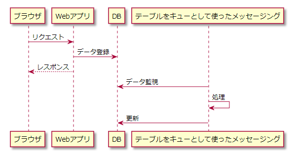

# Nablarchでの非同期処理

NablarchのWebアプリケーションでは、非同期処理は「[テーブルをキューとして使ったメッセージング](https://nablarch.github.io/docs/LATEST/doc/application_framework/application_framework/messaging/db/index.html)」を組み合わることで実現可能です。

例えば、Webアプリケーションで1つのリクエストで処理するには時間がかかり過ぎるものがあるとします。
この場合、以下のようにテーブルをキューとして使ったメッセージングを使用することで非同期処理を実現できます。

- Webアプリはリクエストを受け付けて後続処理に必要なデータをDBに登録し、レスポンスを返却する
- テーブルをキューとして使ったメッセージングがDBへのデータ登録を検知し、当該データの処理を行う

## メール送信を行う場合

Nablarchが提供する[メール送信](https://nablarch.github.io/docs/LATEST/doc/application_framework/application_framework/libraries/mail.html)機能は、「[常駐バッチ](https://nablarch.github.io/docs/LATEST/doc/application_framework/application_framework/batch/nablarch_batch/architecture.html#nablarch-batch-resident-batch)」を前提としています。

「常駐バッチ」と「テーブルをキューとして使ったメッセージング」は、どちらもDBにデータが登録されるのを監視してバッチ処理を実行できます。
しかし、「常駐バッチ」はマルチスレッドで動かしたときに、並列実行されたスレッドが全て終了するまで次のデータ登録の監視が始まらないという問題があります。
このため、新規プロジェクトでは「常駐バッチ」よりも「テーブルをキューとして使ったメッセージング」を使用することが推奨されています。

しかし、メール送信に関しては、そもそもマルチスレッドを必要とするような大量送信に使用することは想定されていません。
したがって、メール送信を利用する場合は、「テーブルをキューとして使ったメッセージング」ではなく「常駐バッチ」を使って問題ありません。
