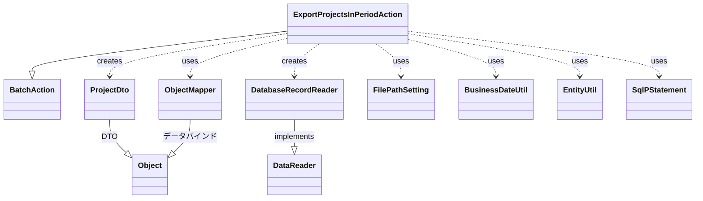
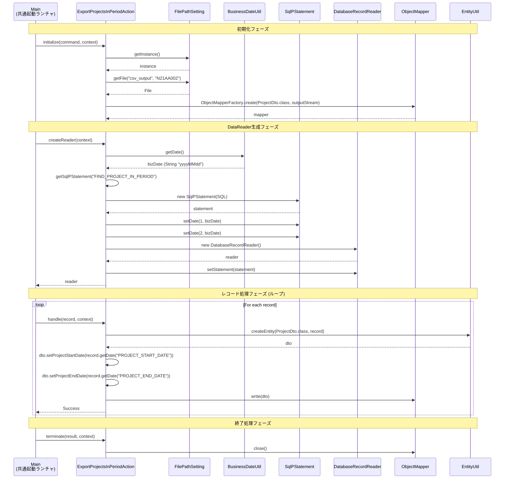

# Code Analysis: ExportProjectsInPeriodAction

**Generated**: 2026-02-10 12:47:41
**Target**: 期間内プロジェクト一覧出力バッチアクション
**Modules**: proman-batch
**Analysis Duration**: 約2分

---

## Overview

`ExportProjectsInPeriodAction`は、業務日付を基準に期間内のプロジェクト一覧をCSVファイルに出力する都度起動バッチアクションです。

### 主な機能

- 業務日付の範囲内に該当するプロジェクトをデータベースから抽出
- プロジェクト情報をCSV形式で出力
- ファイルパス管理による柔軟な出力先設定

### 処理対象

- **入力**: データベース (PROJECT テーブル)
- **出力**: CSV ファイル (N21AA002.csv)
- **条件**: `project_start_date <= 業務日付 AND project_end_date >= 業務日付`

---

## Architecture

### Dependency Graph



**Note**: This diagram uses Mermaid `classDiagram` syntax to show class names and their relationships. Use `--|>` for inheritance (extends/implements) and `..>` for dependencies (uses/creates).

### Component Summary

| Component | Type | Role |
|-----------|------|------|
| `ExportProjectsInPeriodAction` | BatchAction | メインのバッチアクションクラス（業務ロジック実行） |
| `ProjectDto` | DTO | CSV出力用データ転送オブジェクト |
| `DatabaseRecordReader` | DataReader | データベースからレコードを1件ずつ読み込み |
| `ObjectMapper` | ライブラリ | CSV出力処理（データバインド） |
| `FilePathSetting` | ライブラリ | ファイルパス管理（論理名→物理パス） |
| `BusinessDateUtil` | ライブラリ | 業務日付取得 |
| `EntityUtil` | ライブラリ | SqlRowからDTOへの変換 |
| `SqlPStatement` | JDBCラッパー | SQL実行 |

---

## Flow

### Processing Flow

バッチ処理は以下の4つのフェーズで構成されます:

#### 1. 初期化フェーズ (`initialize`)

- **FilePathSetting**から出力ファイルパスを取得
  - 論理名 `"csv_output"` + ファイル名 `"N21AA002"` → 物理パス
- **ObjectMapper**を生成してCSV出力の準備
  - `ObjectMapperFactory.create(ProjectDto.class, outputStream)`
  - ProjectDtoのアノテーション (`@Csv`, `@CsvFormat`) に基づいてCSV形式を決定

#### 2. DataReader生成フェーズ (`createReader`)

- **BusinessDateUtil**から業務日付を取得
  - データベース管理の業務日付を取得
- SQLに業務日付をバインド変数として設定
  - `FIND_PROJECT_IN_PERIOD` SQLを実行準備
  - パラメータ1, 2に業務日付を設定（範囲検索）
- **DatabaseRecordReader**を生成
  - SqlPStatementをセットしてレコード読み込み準備

#### 3. レコード処理フェーズ (`handle`)

**処理単位**: データベースから取得した1レコードごとに実行

1. **EntityUtil**でSqlRowからProjectDtoに変換
   - カラム名とプロパティ名の対応付け
2. 日付項目を明示的に設定
   - `PROJECT_START_DATE`, `PROJECT_END_DATE`は型が異なるため手動設定
   - `record.getDate()` → `dto.setProjectStartDate(Date)`
3. **ObjectMapper**でCSV出力
   - `mapper.write(dto)`
   - DTOの各プロパティ値をCSV形式で書き込み
4. 成功結果を返却
   - `new Success()`

#### 4. 終了処理フェーズ (`terminate`)

- **ObjectMapper**をクローズ
  - リソース解放（ファイルストリームのクローズ）

### Sequence Diagram



---

## Components

### 1. ExportProjectsInPeriodAction

**File**: `proman-batch/src/main/java/com/nablarch/example/proman/batch/project/ExportProjectsInPeriodAction.java`

**Role**: 期間内プロジェクト一覧出力の都度起動バッチアクション

**Key Methods**:
- `initialize()`: ファイル出力準備（ObjectMapper生成）
- `createReader()`: データベースレコードリーダー生成
- `handle()`: 1レコードごとの業務ロジック実行
- `terminate()`: リソース解放

**Dependencies**:
- Nablarch Framework:
  - `BatchAction<SqlRow>` (extends)
  - `DatabaseRecordReader` (creates)
  - `ObjectMapper<ProjectDto>` (uses)
  - `FilePathSetting` (uses)
  - `BusinessDateUtil` (uses)
  - `EntityUtil` (uses)
  - `SqlPStatement` (uses)
- Project:
  - `ProjectDto` (creates)

**Implementation Points**:
- 業務日付を2回バインド（開始日、終了日の範囲検索）
- EntityUtilで自動変換できない日付項目は手動設定

---

### 2. ProjectDto

**File**: `proman-batch/src/main/java/com/nablarch/example/proman/batch/project/ProjectDto.java`

**Role**: プロジェクト情報をCSV出力するためのDTO

**Annotations**:
- `@Csv`: CSV形式定義
  - `type = Csv.CsvType.CUSTOM`
  - `properties = {...}`: プロパティ順序指定
  - `headers = {...}`: CSVヘッダー定義
- `@CsvFormat`: CSV詳細設定
  - `fieldSeparator = ','`
  - `lineSeparator = "\r\n"`
  - `quote = '\"'`
  - `charset = "UTF-8"`
  - `quoteMode = CsvDataBindConfig.QuoteMode.ALL`

**Properties** (13項目):
1. projectId - プロジェクトID
2. projectName - プロジェクト名
3. projectType - プロジェクト種別
4. projectClass - プロジェクト分類
5. projectStartDate - プロジェクト開始日付 (String, Date型から変換)
6. projectEndDate - プロジェクト終了日付 (String, Date型から変換)
7. organizationId - 組織ID
8. clientId - 顧客ID
9. projectManager - プロジェクトマネージャ
10. projectLeader - プロジェクトリーダー
11. note - 備考
12. sales - 売上高
13. versionNo - バージョン番号

**Implementation Points**:
- 全プロパティはString型で定義
- 日付setterでDate型を受け取りyyyy/MM/dd形式に変換

---

### 3. ExportProjectsInPeriodAction.sql

**File**: `proman-batch/src/main/resources/com/nablarch/example/proman/batch/project/ExportProjectsInPeriodAction.sql`

**SQLID**: `FIND_PROJECT_IN_PERIOD`

**Purpose**: 期間内プロジェクトを抽出

**SQL**:
```sql
SELECT
    project_id projectId,
    project_name projectName,
    project_type projectType,
    project_class projectClass,
    project_start_date projectStartDate,
    project_end_date projectEndDate,
    organization_id organizationId,
    client_id clientId,
    pm_kanji_name projectManager,
    pl_kanji_name projectLeader,
    note note,
    sales_amount sales,
    version_no versionNo
FROM
    project
WHERE
    project_start_date <= ?
    AND project_end_date >= ?
ORDER BY
    project_start_date, project_end_date, project_name
```

**Bind Variables**:
- `?` (1): 業務日付 (project_start_date <= 業務日付)
- `?` (2): 業務日付 (project_end_date >= 業務日付)

**Logic**: 業務日付を含む期間のプロジェクトを抽出（開始日 ≦ 業務日付 ≦ 終了日）

---

## Nablarch Framework Usage

### BatchAction

**Knowledge Source**: `nablarch-batch.json:actions`, `nablarch-batch.json:patterns-db-to-file`

BatchActionは汎用的なバッチアクションのテンプレートクラスです。

**必須メソッド**:
- `createReader()`: 使用するDataReaderのインスタンスを返却
- `handle()`: DataReaderから渡された1件分のデータに対する業務ロジックを実装

**このバッチの実装パターン**: DB to FILE
- データベースからデータを読み込み、ファイルに出力するパターン
- `DatabaseRecordReader`を使用してデータベースからレコードを読み込む
- `ObjectMapper`（データバインド）を使用してCSVファイルに出力

---

### DatabaseRecordReader

**Knowledge Source**: `nablarch-batch.json:data-readers`, `data-read-handler.json:overview`

データベースからデータを読み込むDataReaderです。

**使用方法**:
1. DatabaseRecordReaderのインスタンスを生成
2. SqlPStatementを設定
3. createReaderメソッドで返却

**DataReadHandlerとの連携**:
- DataReadHandlerがDataReaderから入力データを1件読み込み、後続ハンドラに処理を委譲
- 実行時IDを自動採番
- データ終端の判定（NoMoreRecordの返却）

---

### ObjectMapper / ObjectMapperFactory (データバインド)

**Knowledge Source**: `data-bind.json:overview`, `data-bind.json:usage`, `data-bind.json:csv_format_beans`

CSVやTSV、固定長といったデータをJava BeansオブジェクトまたはMapオブジェクトとして扱う機能です。

**このバッチでの使用方法**:
1. `ObjectMapperFactory.create(ProjectDto.class, outputStream)`でObjectMapper生成
2. `mapper.write(dto)`でJava BeansオブジェクトをCSVに書き込み
3. `mapper.close()`でリソース解放

**フォーマット指定**:
- ProjectDtoの`@Csv`および`@CsvFormat`アノテーションで指定
- CSV項目順序、ヘッダー、区切り文字、文字コード等を定義

**重要な注意点**:
- try-with-resourcesを使用して自動的にclose()が呼ばれるようにすることを推奨
- ObjectMapperはスレッドアンセーフ（本バッチはシングルスレッドなので問題なし）

---

### FilePathSetting

**Knowledge Source**: `file-path-management.json:overview`, `file-path-management.json:usage`

システムで使用するファイルの入出力先のディレクトリや拡張子を論理名で管理する機能です。

**このバッチでの使用方法**:
1. `FilePathSetting.getInstance()`でインスタンス取得
2. `getFile("csv_output", "N21AA002")`で論理名からファイルパスを取得
   - 論理名 `"csv_output"` → コンポーネント設定で定義された物理パス
   - ファイル名 `"N21AA002"` → 拡張子は論理名の設定から自動付与

**利点**:
- 環境ごとに異なるディレクトリパスをコンポーネント設定ファイルで切り替え
- コードを変更せずに複数環境に対応可能

---

### BusinessDateUtil

**Knowledge Source**: `business-date.json:overview`, `business-date.json:business_date_usage`

業務日付の取得機能です。データベースで管理されている業務日付を取得します。

**このバッチでの使用方法**:
1. `BusinessDateUtil.getDate()`でデフォルト区分の業務日付を取得
2. 戻り値はyyyyMMdd形式の文字列
3. `DateUtil.getDate()`でString→Date型に変換
4. `new Date()`でjava.util.Date→java.sql.Dateに変換

**特徴**:
- データベースの業務日付テーブルから取得
- 区分ごとに複数の業務日付を管理可能
- バッチ処理の障害時再実行で過去日付を上書き可能（システムプロパティで指定）

---

### EntityUtil

**Knowledge Source**: データベースアクセスライブラリの一部として機能

SqlRowからEntityクラス（またはDTO）を生成するユーティリティです。

**このバッチでの使用方法**:
1. `EntityUtil.createEntity(ProjectDto.class, record)`
2. SqlRowのカラム名とDTOのプロパティ名を対応付けて自動変換
3. 型変換は`BeanUtil`を使用して実行

**制約事項**:
- カラム名とプロパティ名が一致している必要がある
- BeanUtilで対応していない型変換は手動で実施
- このバッチでは日付項目を手動設定（`setProjectStartDate`, `setProjectEndDate`）

---

### SqlPStatement (JDBCラッパー)

**Knowledge Source**: `database-access.json:overview`, `database-access.json:execute_sql`

SQLファイルに定義したSQLを実行するためのJDBCラッパーです。

**このバッチでの使用方法**:
1. `getSqlPStatement("FIND_PROJECT_IN_PERIOD")`でSQLID指定
2. `statement.setDate(1, bizDate)`でバインド変数設定
3. DatabaseRecordReaderに渡してレコード読み込み

**特徴**:
- SQLインジェクション対策（PreparedStatement使用）
- SQLファイルによるSQL管理
- バインド変数による安全なパラメータ設定

---

## References

### Source Files

- [`proman-batch/src/main/java/com/nablarch/example/proman/batch/project/ExportProjectsInPeriodAction.java:1`](proman-batch/src/main/java/com/nablarch/example/proman/batch/project/ExportProjectsInPeriodAction.java#L1)
- [`proman-batch/src/main/java/com/nablarch/example/proman/batch/project/ProjectDto.java:1`](proman-batch/src/main/java/com/nablarch/example/proman/batch/project/ProjectDto.java#L1)
- [`proman-batch/src/main/resources/com/nablarch/example/proman/batch/project/ExportProjectsInPeriodAction.sql:1`](proman-batch/src/main/resources/com/nablarch/example/proman/batch/project/ExportProjectsInPeriodAction.sql#L1)

### Nablarch Knowledge

**Knowledge files used in this analysis**:

- **Nablarchバッチ**: `.claude/skills/nabledge-6/knowledge/features/processing/nablarch-batch.json`
  - Sections: `overview`, `actions`, `patterns-db-to-file`
- **データリードハンドラ**: `.claude/skills/nabledge-6/knowledge/features/handlers/batch/data-read-handler.json`
  - Sections: `overview`, `processing`
- **データバインド**: `.claude/skills/nabledge-6/knowledge/features/libraries/data-bind.json`
  - Sections: `overview`, `usage`, `csv_format_beans`
- **ファイルパス管理**: `.claude/skills/nabledge-6/knowledge/features/libraries/file-path-management.json`
  - Sections: `overview`, `usage`
- **業務日付**: `.claude/skills/nabledge-6/knowledge/features/libraries/business-date.json`
  - Sections: `overview`, `business_date_usage`
- **データベースアクセス**: `.claude/skills/nabledge-6/knowledge/features/libraries/database-access.json`
  - Sections: `overview`, `execute_sql`

### Official Documentation

- [Nablarch Official Docs](https://nablarch.github.io/docs/LATEST/doc/)
- [Nablarchバッチアプリケーション](https://nablarch.github.io/docs/LATEST/doc/application_framework/application_framework/batch/nablarch_batch/index.html)

---

**Note**: This documentation was generated by the code-analysis workflow of the nabledge-6 skill.
