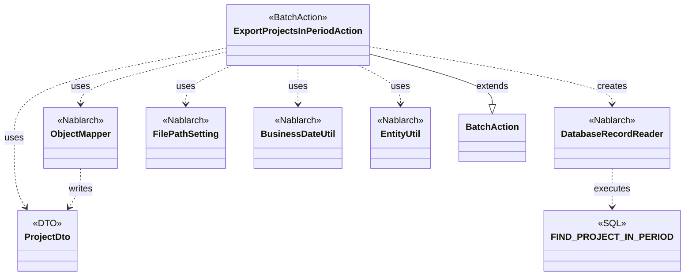
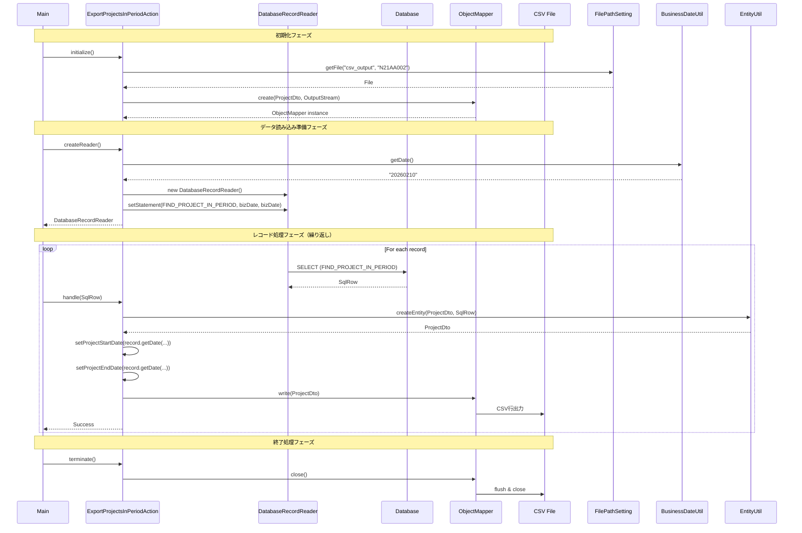

# Code Analysis: ExportProjectsInPeriodAction

**Generated**: 2026-02-10 15:49:43
**Target**: 期間内プロジェクト一覧出力バッチアクション
**Modules**: proman-batch
**Analysis Duration**: 約7分45秒

---

## Overview

ExportProjectsInPeriodActionは、業務日付を基準に期間内のプロジェクト情報をデータベースから抽出し、CSV形式で出力するNablarchバッチアクションです。

**目的**:
- 業務日付を基準とした期間内プロジェクトの抽出
- プロジェクト情報のCSVファイル出力
- 外部システム連携や分析用データの提供

**処理パターン**: DB to FILE（Nablarchバッチ標準パターン）

**主要コンポーネント**:
- `ExportProjectsInPeriodAction` - バッチアクションクラス
- `ProjectDto` - CSV出力用データ転送オブジェクト
- `FIND_PROJECT_IN_PERIOD` - 期間内プロジェクト検索SQL

---

## Architecture

### Dependency Graph



**Note**: This diagram uses Mermaid `classDiagram` syntax to show class names and their relationships. Use `--|>` for inheritance (extends/implements) and `..>` for dependencies (uses/creates).

### Component Summary

| Component | Role | Type | Dependencies |
|-----------|------|------|--------------|
| ExportProjectsInPeriodAction | 期間内プロジェクト一覧CSV出力 | Action | DatabaseRecordReader, ObjectMapper, FilePathSetting, BusinessDateUtil, EntityUtil |
| ProjectDto | プロジェクト情報データ転送オブジェクト | DTO | DateUtil, @Csv, @CsvFormat |
| FIND_PROJECT_IN_PERIOD | 期間内プロジェクト検索クエリ | SQL | なし |

---

## Flow

### Processing Flow

1. **初期化フェーズ** (`initialize`)
   - FilePathSettingから出力ファイルパス（論理名: `csv_output`, ファイル名: `N21AA002`）を取得
   - FileOutputStreamを生成
   - ObjectMapperFactoryで ProjectDto用のObjectMapperを生成

2. **データ読み込みフェーズ** (`createReader`)
   - DatabaseRecordReaderを生成
   - FIND_PROJECT_IN_PERIOD SQLを取得
   - BusinessDateUtilから業務日付を取得してjava.sql.Dateに変換
   - SQLパラメータに業務日付を2回設定（開始日・終了日の比較条件）
   - DatabaseRecordReaderにSQLを設定して返却

3. **レコード処理フェーズ** (`handle` - レコード毎に繰り返し)
   - SqlRowからEntityUtil.createEntityでProjectDtoを生成
   - 日付型カラム（project_start_date, project_end_date）は明示的にsetterで設定
   - ObjectMapper.writeでCSV出力
   - Success結果を返却

4. **終了処理フェーズ** (`terminate`)
   - ObjectMapper.closeでバッファフラッシュとリソース解放

### Sequence Diagram



---

## Components

### 1. ExportProjectsInPeriodAction

**File**: [ExportProjectsInPeriodAction.java:31-81](../../proman-batch/src/main/java/com/nablarch/example/proman/batch/project/ExportProjectsInPeriodAction.java)

**Role**: 期間内プロジェクト一覧出力の都度起動バッチアクションクラス

**Key Methods**:
- `initialize(CommandLine, ExecutionContext)` [:44-54] - ファイル出力先の準備とObjectMapper生成
- `createReader(ExecutionContext)` [:57-65] - DatabaseRecordReaderを生成してSQLを設定
- `handle(SqlRow, ExecutionContext)` [:68-75] - 1レコードをProjectDtoに変換してCSV出力
- `terminate(Result, ExecutionContext)` [:78-80] - ObjectMapperをクローズ

**Dependencies**:
- Nablarch: BatchAction, DatabaseRecordReader, ObjectMapper, FilePathSetting, BusinessDateUtil, EntityUtil
- Project: ProjectDto
- SQL: FIND_PROJECT_IN_PERIOD

**Implementation Points**:
- BatchAction<SqlRow>を継承してテンプレートメソッドパターンで実装
- 出力ファイルパスはFilePathSettingで論理名管理（環境差異を吸収）
- ObjectMapperをフィールドに保持してinitialize～terminateで管理
- EntityUtil.createEntityでSqlRowからDTOに自動変換（型の違う項目は個別設定）

### 2. ProjectDto

**File**: [ProjectDto.java:22-269](../../proman-batch/src/main/java/com/nablarch/example/proman/batch/project/ProjectDto.java)

**Role**: 期間内プロジェクト一覧出力用のデータ転送オブジェクト

**Annotations**:
- `@Csv` [:15-19] - CSV出力項目順序とヘッダー定義（13項目）
- `@CsvFormat` [:20-21] - CSV詳細設定（カンマ区切り、CRLF、UTF-8、全項目クォート）

**Properties** (13 fields):
- プロジェクトID、プロジェクト名、プロジェクト種別、プロジェクト分類
- プロジェクト開始日付、プロジェクト終了日付
- 組織ID、顧客ID、プロジェクトマネージャ、プロジェクトリーダー
- 備考、売上高、バージョン番号

**Implementation Points**:
- 全プロパティはString型（CSV出力のため）
- 日付項目のsetterはDate型を受け取りDateUtil.formatDateでyyyy/MM/dd形式に変換 [:138-140, :154-156]
- @CsvのpropertiesでCSV列順を明示的に定義
- @CsvFormatのquoteMode = ALLで全項目をダブルクォートで囲む

### 3. FIND_PROJECT_IN_PERIOD

**File**: [ExportProjectsInPeriodAction.sql:1-24](../../proman-batch/src/main/resources/com/nablarch/example/proman/batch/project/ExportProjectsInPeriodAction.sql)

**Role**: 期間内プロジェクト検索クエリ

**SQL Structure**:
```sql
SELECT
    project_id, project_name, project_type, project_class,
    project_start_date, project_end_date,
    organization_id, client_id,
    pm_kanji_name, pl_kanji_name,
    note, sales_amount, version_no
FROM project
WHERE
    project_start_date <= ?  -- 業務日付（期間終了条件）
    AND project_end_date >= ?  -- 業務日付（期間開始条件）
ORDER BY project_start_date, project_end_date, project_name
```

**Query Logic**:
- パラメータ1,2: 業務日付（同じ値を2回）
- 条件: プロジェクト期間が業務日付と重なるもの（開始日<=業務日付 AND 終了日>=業務日付）
- ソート: 開始日→終了日→プロジェクト名の昇順

**Implementation Points**:
- カラム名とProjectDtoのプロパティ名を一致させることでEntityUtilの自動変換が可能
- pm_kanji_name → projectManager, pl_kanji_name → projectLeader の変換はEntityUtilが処理
- 日付型カラムはEntityUtilの制約によりActionで明示的に設定

---

## Nablarch Framework Usage

### BatchAction

**クラス**: `nablarch.fw.action.BatchAction<TData>`

**説明**: バッチアクションのテンプレートクラス。データリーダから渡されるデータに対して業務ロジックを実行する

**使用方法**:
```java
public class ExportProjectsInPeriodAction extends BatchAction<SqlRow> {
    @Override
    protected void initialize(CommandLine command, ExecutionContext context) {
        // 初期化処理（ファイル準備、リソース生成等）
    }

    @Override
    public DataReader<SqlRow> createReader(ExecutionContext context) {
        // データリーダ生成（DatabaseRecordReader等）
        return reader;
    }

    @Override
    public Result handle(SqlRow record, ExecutionContext context) {
        // レコード毎の処理
        return new Success();
    }

    @Override
    protected void terminate(Result result, ExecutionContext context) {
        // 終了処理（リソース解放等）
    }
}
```

**重要ポイント**:
- ✅ **テンプレートメソッドパターン**: initialize → createReader → handle(繰り返し) → terminate の順に実行される
- 💡 **責務分離**: データ読み込み（createReader）と業務処理（handle）を分離することで保守性向上
- 🎯 **いつ使うか**: DB to FILE、FILE to DB、DB to DBの各パターンで使用
- ⚠️ **型パラメータ**: BatchAction<SqlRow>でレコード型を指定（DatabaseRecordReader使用時）

**このコードでの使い方**:
- `initialize()`: ObjectMapperを生成してフィールドに保持 [:44-54]
- `createReader()`: DatabaseRecordReaderを生成してFIND_PROJECT_IN_PERIOD SQLを設定 [:57-65]
- `handle()`: SqlRowをProjectDtoに変換してCSV出力 [:68-75]
- `terminate()`: ObjectMapperをクローズしてリソース解放 [:78-80]

**詳細**: [Nablarchバッチ処理](../../.claude/skills/nabledge-6/docs/features/processing/nablarch-batch.md)

### DatabaseRecordReader

**クラス**: `nablarch.fw.reader.DatabaseRecordReader`

**説明**: データベースからレコードを1件ずつ読み込むデータリーダ

**使用方法**:
```java
DatabaseRecordReader reader = new DatabaseRecordReader();
SqlPStatement statement = getSqlPStatement("FIND_PROJECT_IN_PERIOD");
statement.setDate(1, bizDate);
statement.setDate(2, bizDate);
reader.setStatement(statement);
return reader;
```

**重要ポイント**:
- 💡 **メモリ効率**: カーソルで1件ずつ読み込むため、大量データでもメモリ圧迫なし
- ✅ **SQLパラメータ設定**: getSqlPStatementでSQL取得後、setXxxでパラメータバインド
- 🎯 **いつ使うか**: DB to FILE、DB to DBパターンのデータ読み込みで使用
- ⚠️ **トランザクション管理**: LoopHandlerのcommit intervalに従ってコミット

**このコードでの使い方**:
- `createReader()`でDatabaseRecordReaderを生成 [:58]
- FIND_PROJECT_IN_PERIOD SQLを取得してパラメータ設定 [:59-62]
- reader.setStatementでSQL設定して返却 [:63-64]

**詳細**: [Nablarchバッチ処理](../../.claude/skills/nabledge-6/docs/features/processing/nablarch-batch.md)

### ObjectMapper

**クラス**: `nablarch.common.databind.ObjectMapper`

**説明**: CSVやTSV、固定長データをJava Beansとして扱う機能を提供する

**使用方法**:
```java
// 生成
ObjectMapper<ProjectDto> mapper = ObjectMapperFactory.create(ProjectDto.class, outputStream);

// 書き込み
mapper.write(dto);

// クローズ
mapper.close();
```

**重要ポイント**:
- ✅ **必ず`close()`を呼ぶ**: バッファをフラッシュし、リソースを解放する（`terminate()`で実施）
- ⚠️ **大量データ処理時**: メモリに全データを保持しないため、大量データでも問題なく処理可能
- ⚠️ **型変換の制限**: `EntityUtil`と同様に、複雑な型変換が必要な項目は個別設定が必要
- 💡 **アノテーション駆動**: `@Csv`, `@CsvFormat`でフォーマットを宣言的に定義できる
- 💡 **保守性の高さ**: フォーマット変更時はアノテーションを変更するだけで対応可能

**このコードでの使い方**:
- `initialize()`でProjectDto用のObjectMapperを生成 [:48-50]
- `handle()`で各レコードを`mapper.write(dto)`で出力 [:73]
- `terminate()`で`mapper.close()`してリソース解放 [:79]

**詳細**: [データバインド](../../.claude/skills/nabledge-6/docs/features/libraries/data-bind.md)

### BusinessDateUtil

**クラス**: `nablarch.core.date.BusinessDateUtil`

**説明**: システム全体で統一された業務日付を取得する機能を提供する

**使用方法**:
```java
// デフォルト区分の業務日付
String bizDate = BusinessDateUtil.getDate();
// → "20260210"（yyyyMMdd形式）

// 区分別の業務日付
String batchDate = BusinessDateUtil.getDate("batch");
```

**重要ポイント**:
- 💡 **システム横断の日付統一**: `System.currentTimeMillis()`や`LocalDate.now()`ではなく、これを使うことでバッチ処理と画面処理で同じ業務日付を共有できる
- ✅ **必ずDatabaseRecordReaderのパラメータに変換**: 取得した文字列は`java.sql.Date`に変換してSQLパラメータに設定する
- 🎯 **いつ使うか**: 日付ベースの検索条件、レポート生成、ファイル名の日付部分など
- ⚠️ **設定が必要**: システムリポジトリに業務日付テーブルまたは固定値を設定する必要がある

**このコードでの使い方**:
- `createReader()`で業務日付を取得 [:60]
- `java.sql.Date`に変換してSQLパラメータに設定 [:60-62]
- プロジェクトの開始日・終了日との比較条件として使用

**詳細**: [業務日付管理](../../.claude/skills/nabledge-6/docs/features/libraries/business-date.md)

### FilePathSetting

**クラス**: `nablarch.core.util.FilePathSetting`

**説明**: ファイルの入出力先ディレクトリを論理名で管理する機能を提供する

**使用方法**:
```java
FilePathSetting filePathSetting = FilePathSetting.getInstance();
File output = filePathSetting.getFile("csv_output", "N21AA002");
// → /var/nablarch/output/N21AA002.csv
```

**重要ポイント**:
- 💡 **環境差異の吸収**: 論理名を使うことで、開発・テスト・本番環境のパス差異をコード変更なしで対応
- ✅ **システムリポジトリで設定**: basePathSettingsとfileExtensionsで論理名と物理パスをマッピング
- 🎯 **いつ使うか**: バッチ処理のファイル入出力、ファイルアップロード/ダウンロード
- ⚠️ **拡張子の自動付与**: 論理名に対応する拡張子が自動的に付与される

**このコードでの使い方**:
- `initialize()`でFilePathSetting.getInstance()を取得 [:45]
- 論理名`csv_output`とファイル名`N21AA002`を指定してFileオブジェクト取得 [:46-47]
- FileOutputStreamの生成に使用 [:49]

**詳細**: [ファイルパス管理](../../.claude/skills/nabledge-6/docs/features/libraries/file-path-management.md)

### EntityUtil

**クラス**: `nablarch.common.dao.EntityUtil`

**説明**: SqlRowやMapからEntityオブジェクトを生成するユーティリティ

**使用方法**:
```java
ProjectDto dto = EntityUtil.createEntity(ProjectDto.class, record);
```

**重要ポイント**:
- 💡 **自動型変換**: SqlRowのカラム値をBeanUtilで自動的に型変換してDTOのプロパティに設定
- ⚠️ **プロパティ名とカラム名の一致が必要**: スネークケース→キャメルケース変換は行われる（project_id → projectId）
- ⚠️ **型変換の制限**: Date型からString型への変換など、複雑な型変換は自動で行われないため個別設定が必要
- 🎯 **いつ使うか**: DatabaseRecordReaderで読み込んだSqlRowをDTOに変換する際

**このコードでの使い方**:
- `handle()`でSqlRowからProjectDtoを生成 [:69]
- 日付型カラムは自動変換できないため、個別にsetterを呼び出し [:71-72]

**詳細**: [データベースアクセス](../../.claude/skills/nabledge-6/docs/features/libraries/database-access.md)

---

## References

### Source Files

- [ExportProjectsInPeriodAction.java](../../proman-batch/src/main/java/com/nablarch/example/proman/batch/project/ExportProjectsInPeriodAction.java) - 期間内プロジェクト一覧出力バッチアクション
- [ProjectDto.java](../../proman-batch/src/main/java/com/nablarch/example/proman/batch/project/ProjectDto.java) - CSV出力用データ転送オブジェクト
- [ExportProjectsInPeriodAction.sql](../../proman-batch/src/main/resources/com/nablarch/example/proman/batch/project/ExportProjectsInPeriodAction.sql) - 期間内プロジェクト検索SQL

### Knowledge Base (Nabledge-6)

- [Nablarchバッチ処理](../../.claude/skills/nabledge-6/docs/features/processing/nablarch-batch.md) - BatchActionの詳細、DB to FILEパターン、都度起動バッチ、DataReader
- [データバインド](../../.claude/skills/nabledge-6/docs/features/libraries/data-bind.md) - ObjectMapperの詳細仕様、@Csvアノテーション、フォーマット設定
- [業務日付管理](../../.claude/skills/nabledge-6/docs/features/libraries/business-date.md) - BusinessDateUtilの使い方、区分管理、テーブル設定
- [ファイルパス管理](../../.claude/skills/nabledge-6/docs/features/libraries/file-path-management.md) - FilePathSettingの設定方法、論理名と物理パスのマッピング
- [データベースアクセス](../../.claude/skills/nabledge-6/docs/features/libraries/database-access.md) - SqlPStatement、SqlRow、EntityUtilの使い方
- [データリードハンドラ](../../.claude/skills/nabledge-6/docs/features/handlers/batch/data-read-handler.md) - DataReadHandlerの役割、処理フロー

### Official Documentation

- [Nablarchバッチ処理](https://nablarch.github.io/docs/LATEST/doc/application_framework/application_framework/batch/index.html)
- [データバインド](https://nablarch.github.io/docs/LATEST/doc/application_framework/application_framework/libraries/data_io/data_bind.html)
- [業務日付管理](https://nablarch.github.io/docs/LATEST/doc/application_framework/application_framework/libraries/system_utility/business_date.html)
- [ファイルパス管理](https://nablarch.github.io/docs/LATEST/doc/application_framework/application_framework/libraries/file_path_management.html)
- [データベースアクセス（JDBCラッパー）](https://nablarch.github.io/docs/LATEST/doc/application_framework/application_framework/libraries/database/database.html)

---

**Note**: This documentation was generated by the code-analysis workflow of the nabledge-6 skill.
