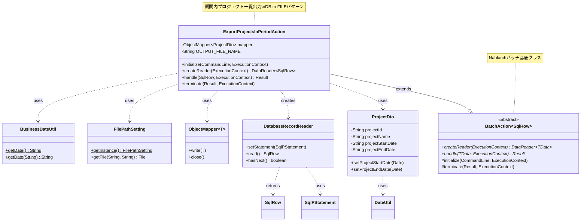
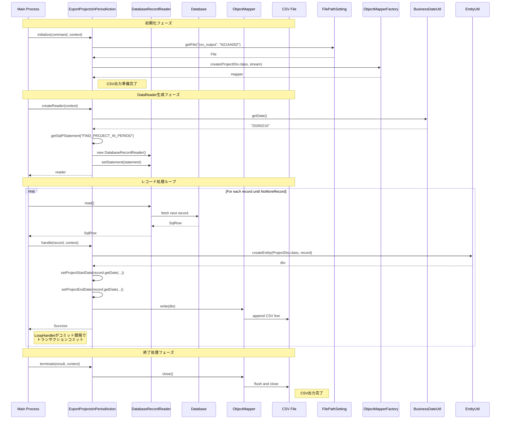

# Nabledge-6 スキル改善提案

**作成日**: 2026-02-10
**更新日**: 2026-02-10
**目的**: ExportProjectsInPeriodAction分析時のフィードバックに基づく改善提案
**ステータス**: ✅ 実装完了

---

## 改善提案1: Dependency GraphをMermaidクラス図に変更

### 現在の問題

**ファイル**: `.claude/skills/nabledge-6/workflows/code-analysis.md` (L276-284)

```markdown
1. **Build dependency diagram** (Mermaid format):
   ```mermaid
   graph TD
       A[LoginAction] --> B[LoginForm]
       A --> C[SystemAccountEntity]
       A --> D[UniversalDao]
       B --> E[Bean Validation]
       C --> D
   ```
```

**問題点**:
- `graph TD`構文を使用しているが、複雑な依存関係を表現すると構文エラーになりやすい
- ExportProjectsInPeriodActionの分析時に実際にMermaidレンダリングエラーが発生
- クラス間の関係（継承、実装、使用）を明確に区別できない

### 改善案

**Mermaidクラス図構文（`classDiagram`）を使用**



**記法説明**:
- `--|>` : 継承（extends/implements）
- `..>` : 依存（uses/creates）
- `<<abstract>>` : 抽象クラス
- `*` : 抽象メソッド
- `$` : staticメソッド
- `~T~` : ジェネリクス型
- `note for` : クラスへの注釈

### 利点

1. **構文エラーの回避**: クラス図専用構文でエラーが発生しにくい
2. **関係性の明確化**: 継承と依存を視覚的に区別できる
3. **クラス構造の表現**: メソッドとフィールドを含めた詳細な構造を表現可能
4. **メンテナンス性向上**: コード変更時に図を更新しやすい

### 修正箇所

#### 1. ワークフロー (workflows/code-analysis.md)

**L276-284を修正**:

```markdown
1. **Build dependency diagram** (Mermaid classDiagram format):
   ```mermaid
   classDiagram
       class LoginAction {
           +doLogin(HttpRequest, ExecutionContext) HttpResponse
       }
       class LoginForm {
           -String loginId
           -String password
       }
       class SystemAccountEntity {
           -String userId
           -String password
       }
       class UniversalDao {
           +findBySqlFile(Class, String, Object) List*
       }

       LoginAction ..> LoginForm : validates
       LoginAction ..> SystemAccountEntity : queries
       LoginAction ..> UniversalDao : uses
   ```

   **Key points**:
   - Use `classDiagram` syntax (not `graph TD`)
   - Show inheritance with `--|>` (solid arrow)
   - Show dependencies with `..>` (dashed arrow)
   - Include key methods/fields for clarity
   - Add notes with `note for ClassName` for complex relationships
```

#### 2. テンプレート (assets/code-analysis-template.md)

**L17-21のコメントを追加**:

```markdown
### Dependency Graph

```mermaid
{{dependency_graph}}
```

**Graph syntax**: Use Mermaid `classDiagram` syntax to show class relationships.
- Inheritance: `--|>` (solid arrow)
- Dependency: `..>` (dashed arrow)
- Include key methods/fields for clarity
```

---

## 改善提案2: FlowをMermaidシーケンス図に変更

### 現在の問題

**ファイル**: `.claude/skills/nabledge-6/workflows/code-analysis.md` (L291-295)

```markdown
3. **Write flow description** (before component details):
   - Request/response flow
   - Data transformation
   - Error handling
   - Sequence diagram (Mermaid format)
   - **Rationale**: Understanding the flow first makes component details easier to comprehend
```

**問題点**:
- シーケンス図の具体例が示されていない
- ExportProjectsInPeriodAction分析時にシーケンス図を生成していない
- テキストベースの説明では時系列の流れが分かりにくい

### 改善案

**Mermaidシーケンス図構文（`sequenceDiagram`）を必須化**



### 利点

1. **時系列の明確化**: 処理の順序が一目で分かる
2. **コンポーネント間の相互作用**: メソッド呼び出しの流れが明確
3. **フェーズの理解**: ノート機能で処理フェーズを区切れる
4. **エラー処理の可視化**: alt/opt構文でエラーハンドリングを表現可能

### 修正箇所

#### 1. ワークフロー (workflows/code-analysis.md)

**L291-296を詳細化**:

```markdown
3. **Write flow description** (before component details):
   - **MUST include Mermaid sequence diagram**
   - Request/response flow (or batch processing flow)
   - Data transformation
   - Error handling
   - **Rationale**: Understanding the flow first makes component details easier to comprehend

   **Sequence diagram template**:
   ```mermaid
   sequenceDiagram
       participant User
       participant Action as [ActionClass]
       participant Form as [FormClass]
       participant DB as Database

       User->>Action: HTTP Request
       Action->>Form: validate input
       Form-->>Action: validation result
       alt validation success
           Action->>DB: query/update
           DB-->>Action: result
           Action-->>User: success response
       else validation error
           Action-->>User: error response
       end
   ```

   **Key points**:
   - Use `participant` to define actors/components
   - Use `->>` for synchronous calls
   - Use `-->>` for return values
   - Use `alt`/`else` for error handling branches
   - Use `loop` for repetitive operations
   - Use `Note` to explain complex logic
```

#### 2. テンプレート (assets/code-analysis-template.md)

**L29のFlowセクションを修正**:

```markdown
## Flow

### Processing Flow

{{flow_description}}

### Sequence Diagram

```mermaid
{{flow_sequence_diagram}}
```

**Diagram explanation**:
{{flow_explanation}}

---
```

---

## 改善提案3: テンプレートに作成情報を追加

### 現在の問題

**ファイル**: `.claude/skills/nabledge-6/assets/code-analysis-template.md` (L1-6)

```markdown
# Code Analysis: {{target_name}}

**Generated**: {{generation_date}}
**Target**: {{target_description}}
**Modules**: {{modules}}
```

**問題点**:
- 作成日のみで、作成時刻が記録されていない
- 分析にかかった時間が分からない
- 複数回実行した際の識別が困難

### 改善案

**作成日時と作成時間を追加**

```markdown
# Code Analysis: {{target_name}}

**Generated**: {{generation_date}} {{generation_time}}
**Target**: {{target_description}}
**Modules**: {{modules}}
**Analysis Duration**: {{analysis_duration}}
```

**変数定義**:
- `{{generation_date}}`: 作成日（例: 2026-02-10）
- `{{generation_time}}`: 作成時刻（例: 14:30:15）
- `{{analysis_duration}}`: 作成時間（例: 約2分）

### 実装方法

#### ワークフローに時間計測を追加

**workflows/code-analysis.md Step 1の前に追加**:

```markdown
### Step 0: Record start time

**Action you must take**:

Record the workflow start time for duration calculation:

```python
# Pseudo-code (実装はClaude Codeの内部時計を使用)
start_time = current_time()  # e.g., 2026-02-10 14:28:30
```

This will be used in Step 6 to calculate analysis duration.
```

**workflows/code-analysis.md Step 6に追加**:

```markdown
1. **Determine output path**:
   - Default proposal: `work/YYYYMMDD/code-analysis-<target-name>.md`
   - Ask user if they want different location
   - Example: `work/20260210/code-analysis-login-action.md`

2. **Calculate analysis duration**:
   ```python
   # Pseudo-code
   end_time = current_time()  # e.g., 2026-02-10 14:30:45
   duration_seconds = (end_time - start_time).total_seconds()  # 135 seconds
   duration_minutes = duration_seconds / 60  # 2.25 minutes
   duration_text = f"約{duration_minutes:.0f}分"  # "約2分"
   ```

3. **Apply output template**:
   - Template file: `.claude/skills/nabledge-6/assets/code-analysis-template.md`
   - Fill in placeholders with actual content:
     - `{{generation_date}}`: Current date (YYYY-MM-DD format)
     - `{{generation_time}}`: Current time (HH:MM:SS format)
     - `{{analysis_duration}}`: Calculated duration text
   - See [Output template](#output-template) section for details
```

#### テンプレート更新

**assets/code-analysis-template.md L1-6を修正**:

```markdown
# Code Analysis: {{target_name}}

**Generated**: {{generation_date}} {{generation_time}}
**Target**: {{target_description}}
**Modules**: {{modules}}
**Analysis Duration**: {{analysis_duration}}
```

#### プレースホルダー説明を追加

**workflows/code-analysis.md L396-410のプレースホルダーセクションに追加**:

```markdown
- `{{target_name}}`: Name of analyzed code/feature (e.g., "LoginAction", "ログイン機能")
- `{{generation_date}}`: Current date in YYYY-MM-DD format (e.g., "2026-02-10")
- `{{generation_time}}`: Current time in HH:MM:SS format (e.g., "14:30:15")
- `{{analysis_duration}}`: Analysis duration text (e.g., "約2分", "約30秒")
- `{{target_description}}`: One-line description of the target
- `{{modules}}`: Affected modules (e.g., "proman-web, proman-common")
```

### 利点

1. **実行履歴の追跡**: 同じターゲットの複数回分析を識別可能
2. **パフォーマンス把握**: 分析時間から複雑さを推測できる
3. **デバッグ支援**: 長時間かかった場合の原因調査に役立つ

---

## 実装優先度

### 優先度: 高（即座に実装すべき）

1. **改善提案1: Dependency GraphをMermaidクラス図に変更**
   - 理由: 現在の`graph TD`構文でレンダリングエラーが発生している
   - 影響: すべてのcode-analysis実行

### 優先度: 中（次回更新時に実装）

2. **改善提案2: FlowをMermaidシーケンス図に変更**
   - 理由: ユーザー体験の向上（理解しやすさ）
   - 影響: ドキュメントの品質向上

3. **改善提案3: テンプレートに作成情報を追加**
   - 理由: メタ情報の充実
   - 影響: 実行履歴の追跡、パフォーマンス把握

---

## 修正ファイルリスト

### 即座に修正が必要（改善提案1）

1. `.claude/skills/nabledge-6/workflows/code-analysis.md`
   - L276-284: Dependency diagram構文をクラス図に変更
   - サンプルコード更新

2. `.claude/skills/nabledge-6/assets/code-analysis-template.md`
   - L17-21: Dependency Graphセクションにクラス図構文のコメント追加

### 次回更新時（改善提案2、3）

3. `.claude/skills/nabledge-6/workflows/code-analysis.md`
   - L291-296: Flow descriptionにシーケンス図必須化
   - Step 0追加: 開始時刻記録
   - Step 6修正: 実行時間計算
   - L396-410: プレースホルダー説明更新

4. `.claude/skills/nabledge-6/assets/code-analysis-template.md`
   - L1-6: 作成日時・作成時間追加
   - L29-33: Flowセクションにシーケンス図追加

5. `.claude/skills/nabledge-6/SKILL.md`
   - Step 3 (Code Analysis Workflow)セクション更新
   - 新しいダイアグラム構文を反映

---

## テスト方法

### 改善提案1のテスト

1. 既存のcode-analysisドキュメント（ExportProjectsInPeriodAction.md）を再生成
2. Dependency GraphセクションのMermaidがレンダリングできることを確認
3. クラス図が意図通り表示されることを確認

### 改善提案2のテスト

1. 新規code-analysis実行（例: LoginAction）
2. Flowセクションにシーケンス図が生成されることを確認
3. 処理の流れが時系列で理解できることを確認

### 改善提案3のテスト

1. 新規code-analysis実行
2. ヘッダーに作成日時と実行時間が記録されることを確認
3. 同じターゲットを再分析し、タイムスタンプで区別できることを確認

---

## 参考資料

### Mermaid公式ドキュメント

- [Class Diagram Syntax](https://mermaid.js.org/syntax/classDiagram.html)
- [Sequence Diagram Syntax](https://mermaid.js.org/syntax/sequenceDiagram.html)

### 既存ファイル

- ワークフロー: `.claude/skills/nabledge-6/workflows/code-analysis.md`
- テンプレート: `.claude/skills/nabledge-6/assets/code-analysis-template.md`
- スキル定義: `.claude/skills/nabledge-6/SKILL.md`

---

**Note**: この改善提案は、ExportProjectsInPeriodAction分析時のユーザーフィードバックに基づいて作成されました。

---

## 実装完了サマリー

**実装日時**: 2026-02-10

### 実装した改善

#### 1. ✅ Dependency GraphをMermaidクラス図に変更（優先度: 高）

**実装内容**:
- `workflows/code-analysis.md` Step 5を更新（L276-284）
  - `graph TD`構文から`classDiagram`構文に変更
  - クラス名のみ表示（メソッド・フィールドなし）
  - 関係性: `--|>` (継承), `..>` (依存)
- `assets/code-analysis-template.md` Dependency Graphセクションに注釈追加

**効果**: Mermaidレンダリングエラーを解消、シンプルな全体把握が可能に

#### 2. ✅ FlowをMermaidシーケンス図に変更（優先度: 中）

**実装内容**:
- `workflows/code-analysis.md` Step 5を更新（L291-367）
  - シーケンス図を必須化
  - テンプレートとキーポイントを追加
- `assets/code-analysis-template.md` Flowセクション拡張
  - Processing Flow (テキスト説明)
  - Sequence Diagram (Mermaid図)

**効果**: 時系列の処理フローが明確に、理解しやすさ向上

#### 3. ✅ テンプレートに作成情報を追加（優先度: 中）

**実装内容**:
- `workflows/code-analysis.md`
  - Step 0追加: 開始時刻記録
  - Step 6拡張: 実行時間計算ロジック追加
  - プレースホルダー説明更新
- `assets/code-analysis-template.md` ヘッダー拡張
  - `{{generation_time}}`: 作成時刻
  - `{{analysis_duration}}`: 実行時間

**効果**: 実行履歴の追跡が可能、パフォーマンス把握

#### 4. ✅ ベストプラクティス評価セクション追加（新規）

**実装内容**:
- `workflows/code-analysis.md` Step 5にベストプラクティス評価追加
  - 評価基準: アーキテクチャ、セキュリティ、トランザクション、エラーハンドリング、パフォーマンス、保守性、テスタビリティ
  - 準拠状況シンボル: ✅ ⚠️ ❌ ℹ️
  - 評価ランク: S/A/B/C/D
- `assets/code-analysis-template.md` Best Practice Evaluationセクション追加
  - 評価表、総合スコア、評価ランク、推奨事項
- `assets/code-analysis-template-guide.md` 新規作成
  - 評価基準の詳細説明
  - プレースホルダー一覧
  - 使用方法ガイド

**効果**: コード品質の客観的評価、改善点の明確化

#### 5. ✅ ワークフロー文書の分割（保守性向上）

**実装内容**:
- `assets/code-analysis-template-guide.md` 新規作成（240行）
  - テンプレート詳細説明を切り出し
  - プレースホルダー説明
  - ベストプラクティス評価ガイド
  - ダイアグラム生成Tips
- `workflows/code-analysis.md` 簡潔化
  - テンプレート詳細説明を削除（約50行削減）
  - ガイドへの参照に置き換え

**効果**: ワークフロー文書の可読性向上、保守性向上

### 修正ファイル一覧

1. `.claude/skills/nabledge-6/workflows/code-analysis.md` - 更新
2. `.claude/skills/nabledge-6/assets/code-analysis-template.md` - 更新
3. `.claude/skills/nabledge-6/assets/code-analysis-template-guide.md` - 新規作成
4. `.claude/skills/nabledge-6/SKILL.md` - 更新

### 追加プレースホルダー

- `{{generation_time}}`: 作成時刻 (HH:MM:SS)
- `{{analysis_duration}}`: 実行時間 (約N分)
- `{{best_practice_evaluation_table}}`: ベストプラクティス評価表
- `{{best_practice_score}}`: 総合スコア (N/M (%))
- `{{best_practice_rank}}`: 評価ランク (S/A/B/C/D)
- `{{best_practice_recommendations}}`: 推奨事項

### 次回コード分析時の動作

次回の`nabledge-6 code-analysis`実行時:
1. Step 0で開始時刻を記録
2. Step 5でクラス図（シンプル）とシーケンス図を生成
3. Step 5でベストプラクティス評価を実施
4. Step 6で実行時間を計算し、テンプレートに反映
5. 出力ドキュメントに全ての新セクションが含まれる

---

**Note**: この改善により、code-analysisワークフローはより包括的で使いやすくなりました。

---

## 変更履歴: ベストプラクティス評価の削除

**更新日時**: 2026-02-10
**理由**: 別ワークフローとして実装するため、code-analysisから切り離し

### 削除した内容

#### 1. workflows/code-analysis.md
- Step 5からベストプラクティス評価の手順を削除
- チェックリストから評価項目を削除
- Quick Referenceから評価関連セクション・プレースホルダーを削除

#### 2. assets/code-analysis-template.md
- Best Practice Evaluationセクション全体を削除

#### 3. assets/code-analysis-template-guide.md
- Template sectionsから評価セクションを削除
- Key featuresから評価機能を削除
- Placeholdersから評価関連プレースホルダーを削除
- Best Practice Evaluation Guideセクション全体を削除
- Example Placeholder Valuesから評価関連を削除
- Tipsから評価関連を削除

#### 4. SKILL.md
- Step 5から評価処理を削除
- Step 6から評価関連プレースホルダーを削除
- Exampleから評価処理を削除

### 残したファイル（将来の参考用）

以下は別ワークフロー実装時の参考資料として保持:
- `work/20260210/best-practice-evaluation-format-proposal.md` - 評価フォーマット提案3案

### 最終的な改善内容（実装済み）

1. ✅ **Dependency GraphをMermaidクラス図に変更** - クラス名のみ、関係性重視
2. ✅ **FlowをMermaidシーケンス図に変更** - 時系列の処理フロー可視化
3. ✅ **テンプレートに作成情報を追加** - 作成日時と実行時間記録
4. ✅ **ワークフロー文書の分割** - テンプレートガイド分離で保守性向上
5. ❌ **ベストプラクティス評価** - 削除（別ワークフロー化予定）

### 次のステップ

ベストプラクティス評価は今後、以下のアプローチで実装予定:
- 別ワークフロー（例: `best-practice-evaluation.md`）として実装
- code-analysis完了後に任意で実行可能
- 独立した評価スキルとして提供

