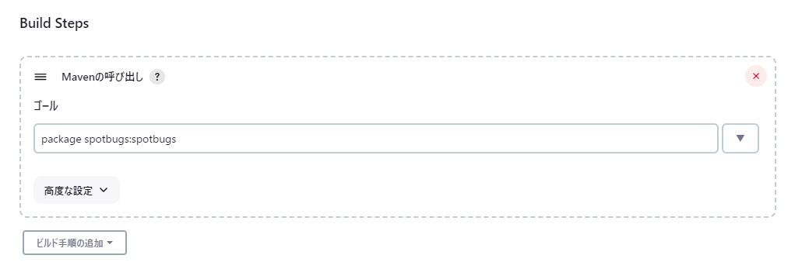
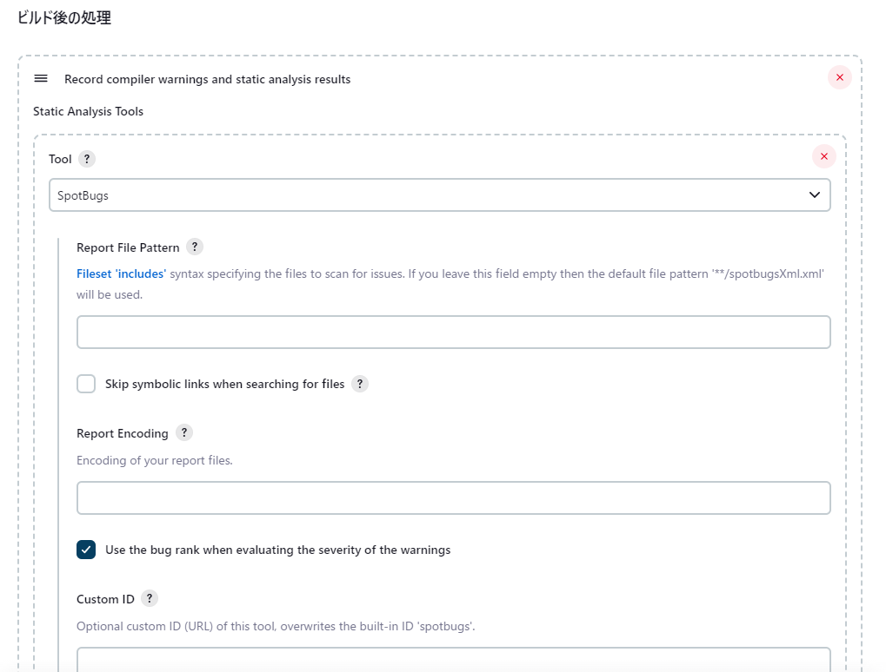
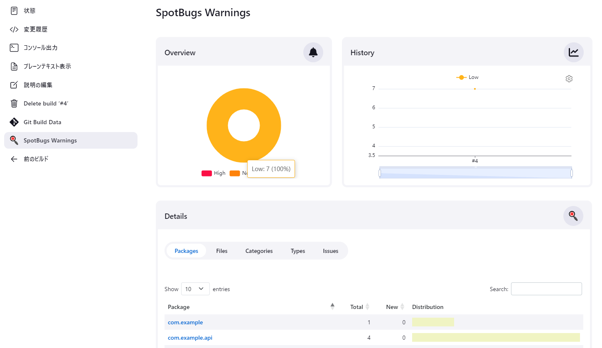

# JenkinsでのSpotBugs実行結果の収集方法

この文書ではJenkinsでプロジェクトのビルドを行った際、SpotBugsの実行結果を収集する方法をガイドします。

なお、この文書の内容はJenkins 2.401.1、Warnings Next Generation Plugin 10.2.0で動作検証を行っています。

## JenkinsにWarnings Next Generation Pluginをインストールする

まずJenkinsにWarnings Next Generation Pluginをインストールします。

メニューから「Jenkinsの管理」を開いて、「System Configuration」にある「Plugins」を選択します。

「Available plugins」で「Warnings Next Generation Plugin」を検索し、「Warnings Next Generation Plugin」にチェックを入れて「再起動せずにインストール」をクリックしてください。

## チェック結果を収集する

ジョブの「設定」を開いて、「Build Steps」に「Mavenの呼び出し」を追加します。
チェック結果を作成するため、「ゴール」に `spotbugs:spotbugs` を追加してください。

チェックはビルド後に行う必要があるため、仮にプロジェクトのビルドを `package` で行う場合、「ゴール」に設定する値は `package spotbugs:spotbugs` になります。

チェック結果を収集するため、「ビルド後の後処理」に「Record compiler warnings and static analysis results」を追加します。
SpotBugsのチェック結果を収集するため、「Tool」で「SpotBugs」を選択します。

これでチェック結果を収集するための設定が出来ました。
あとはビルドを実施するとチェック結果が収集されます。

チェック結果が収集されると、メニューに「SpotBugs Warnings」が表示されます。
「SpotBugs Warnings」を開くと、最新結果の詳細や、違反数の推移を参照できます。

