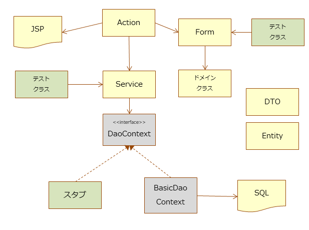

# アプリケーション構成(Web)

本プロジェクトでのWebアプリケーション構成は、テスト容易化を達成するため、
Serviceというクラスを導入します。

- Serviceクラスにビジネスロジックを集約します。
- ServiceクラスではHttpRequestのようなWebアプリケーション実行基盤用のAPIを使用しないでください。
- データベースアクセスについてはUniversalDaoをスタブ化できるようにします。


  
これにより、以下のような効果が期待されます。
- ビジネスロジックを実装したServiceをクラス単体テストでテストできます
- リクエスト単体テストを使う必要がなくなり、テストを省力化できます


## Action

Nablarchでは、Action以降のクラス構成については特に規定がありません。
本プロジェクトでは、Actionの責務を以下のように定めます。

- バリデーション制御
- サービスの呼び出し
- リクエストスコープ、セッションスコープへの値設定
- フォワード

上記以外の処理は、後述する別のクラス(FormやSerivce)にて行います。


## Form

リクエストパラメータの受け取り、入力値のバリデーションを行います（従来のNablarchアプリケーションと違いはありません）。
ただし、画面出力用にJSPへデータ受け渡しをする用途には使用しません(*1)。
そのような用途にはDTOを使用します。

*1: バリデーションエラー時の入力項目復元や確認画面表示用など、全く同じFormの場合は除く。

## Service

ビジネスロジックを実装します。

HttpRequest, HttpResponse, Formような、Web依存のクラスは使用しないようにします。
また、ExecutionContextも使用しないようにします。
これらのクラスの代わりに、そのService用のDTOを引数として受け取るようにします。
これによりServiceクラスのテスタビリティが保たれます。

データベースアクセスについてはUniversalDaoをクラス単体テスト時に置き換えられるようにします。
UniversalDaoクラスはstaticメソッドのみを持つので、インターフェイスであるDaoContextを使用します。


``` java
public class MyService {

    private final DaoContext universalDao;
     
    public MyService() {
        this(DaoFactory.create());
    }
    /** テスト用コンストラクタ */
    MyService(DaoContext universalDao) {
        this.universalDao = universalDao;
    }
}
```

``` java
DaoContext stub = new DaoStub() {
    @Override
    public T findByPk(int id) {
        return (T) new Foo("ふー");
    }
}
```

DAO(Data Access Object)クラスを導入することでも、データベースアクセスの置き換えは可能ですが、
DAOクラス作成にも手間がかかるため、DaoContextの実装を置き換えることとしました。

## Entity

GSPプラグインを使用してER図から自動生成します。

## DTO

データの移送用途に使用します。
