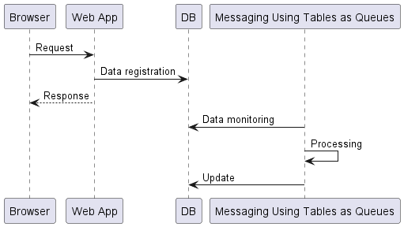

# Asynchronous Operation in Nablarch

In web applications of Nablarch, asynchronous operation can be achieved by combining ["Messaging Using Tables as Queues"](https://nablarch.github.io/docs/LATEST/doc/en/application_framework/application_framework/messaging/db/index.html).

For example, assume that a web application is taking too long to process a single request.

In this case, asynchronous operation can be realized by using the "Messaging Using Tables as Queues" as follows.

- Web application accepts the request, registers data necessary for subsequent processing in DB, and returns the response
- "Messaging Using Tables as Queues" detects data registration to DB and processes the data

## To sending emails

[The sending emailes](https://nablarch.github.io/docs/LATEST/doc/en/application_framework/application_framework/libraries/mail.html) functionality provided by Nablarch is based on [Resident batch](https://nablarch.github.io/docs/LATEST/doc/en/application_framework/application_framework/batch/nablarch_batch/architecture.html#nablarch-batch-resident-batch).

Both "Resident batch" and "Messaging Using Tables as Queues" can monitor data registration to the DB and execute batch processing.
However, "Resident batch" has a problem that when running in multi-threaded mode, monitoring of the next data registration does not start until all threads running in parallel finish.
Therefore, it is recommended that new projects use "Messaging Using Tables as Queues" rather than "Resident batch".

However, the sending emailes is not supposed to be used for sending so many messages that multi-threading is required in the first place.
Therefore, when using the sending emails, there is no problem using "Resident batch" instead of "Messaging Using Tables as Queues".
