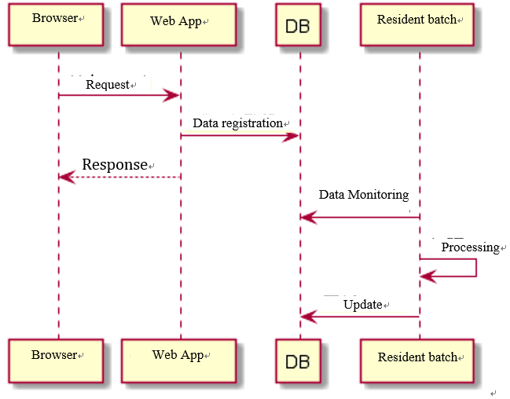

# Asynchronous Operation in Nablarch

<<<<<<< HEAD
In Web applications of Nablarch, asynchronous operation can be achieved by combining "resident batches".

For example, assume that a Web application is taking too long to process a single request.
=======
In web applications of Nablarch, asynchronous operation can be achieved by combining "resident batches".

For example, assume that a web application is taking too long to process a single request.
>>>>>>> 2aecddaa5a1529732d5207d5a08823b5737bb34a
In this case, asynchronous operation can be realized by using a resident batch as follows.

- Web application accepts the request, registers data necessary for subsequent processing in DB, and returns the response
- Resident batch detects data registration to DB and processes the data

