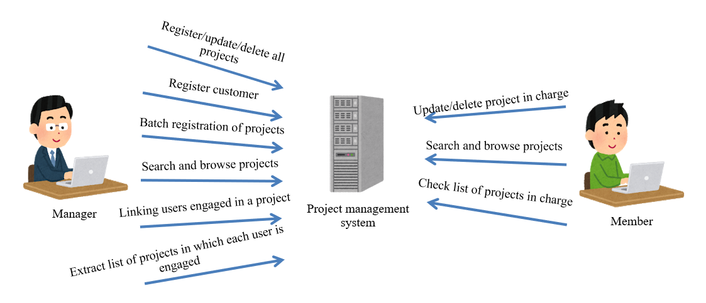
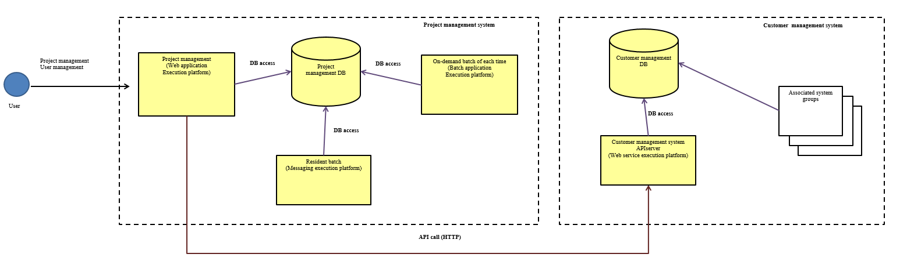
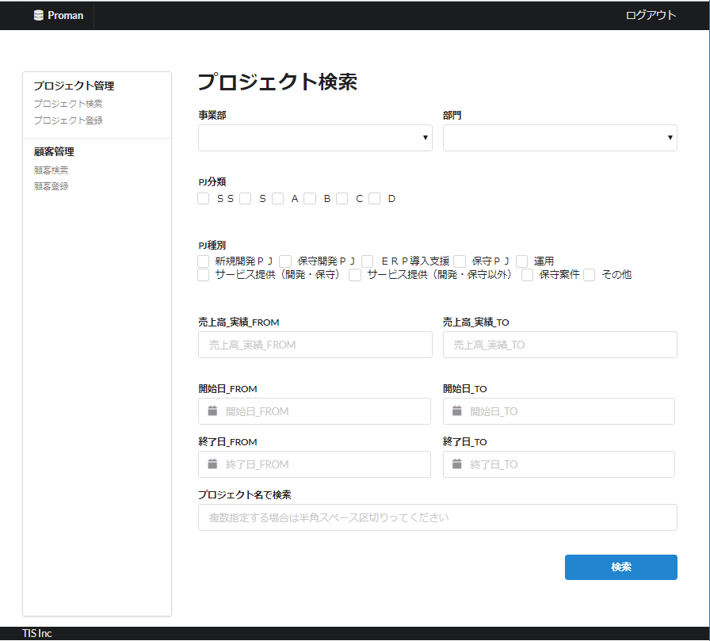

# Sample Project

> ＜For those who refer to the sample project＞  
> The sample project is to have an image of the deliverables created when development is carried out according to the [Nablarch System Development Guide](../Nablarch-system-development-guide)
> You can refer to the development guides and test standards that are important when carrying out development in a project. 
> Several functions have been developed using the development guide created with samples for each processing method (Web, batch and REST), and correspondence between design documents and source code can be confirmed.
>
> However, deliverables have been prepared according to the requirements, characteristics, and circumstances of the sample project, 
> and deliverables of the sample project will not function universally in all development projects. 
> The source code has not been created with the intention that it can be used in other projects without making any changes. 
> The sample project focuses on conveying the image of using the Nablarch System Development Guide.
>   
> If you would like to see the best examples of application implementation using Nablarch, please refer to Nablarch 
> [Example](https://nablarch.github.io/docs/LATEST/doc/en/application_framework/example/index.html) 
> or [manual](https://nablarch.github.io/docs/LATEST/doc/en/application_framework/application_framework/index.html).

- [System profile](#System-profile)
- [System configuration image](#System-configuration-image)
  - [User](#User)
- [Screen image](#Screen-image)
  - [Project search screen](#Project-search-screen)
- [Function requirements](#Function-requirements)
  - [Screen](#Screen)
  - [On-demand batch](#On-demand-batch)
  - [Resident batch](#Resident-batch)
  - [API server](#API-server)
- [Non-functional requirements](#Non-functional-requirements)
  - [Authentication requirements](#Authentication-requirements)
  - [Authorization requirements](#Authorization-requirements)
  - [User interface requirements](#User-interface-requirements)
  - [Performance requirements](#Performance-requirements)
  - [Availability requirements](#Availability-requirements)
  - [Security requirements](#Security-requirements)
  - [Not applicable](#Not-applicable)

## System profile

- Build a new "project management system" for Company A.
- The "project management system" manages the size, customers, period, and project staff of projects implemented by each department of Company A.
- The "project management system" independently manages user information to perform a small start.
- Company A already has a "customer management system", which has to be referred to/updated by the "project management system". The security policy does not allow direct access to the DB of this system, and a new API server will be built for the in-house publication of some of the functions.

## System configuration image
- The yellow part in the figure below is the development target range.

### User
- Users are those among the employees of Company A who are explicitly registered in the "Project Management System"

## Screen image
### Project search screen

## Function requirements

### Screen
- Provides project management functions that can perform the following operations on the assumption that the user is already logged in.
    - Enables project information to be registered, updated and deleted on the screen.
    - There are two types of user roles: manager and member.
    - Enables searching of the registered project information with a combination of multiple conditions. Both managers and members can view information on all projects.
        - Performs paging display as the search results can be a large number.
        - The list of search results can be downloaded as a CSV file.
        - The customer list is obtained from the "customer management system" using the API.
    - Managers can register, update, and delete all projects.
    - Managers can register new customer information.
        - The registration of customer information is realized by an API request to the "customer management system".
    - Managers can batch register projects from uploaded CSV files.
        - Update the registered project
    - The manager can link users engaged with each project.
    - Members can update/delete only projects that they manage.
    - Only the operations that can be performed by the user are provided as flow lines to the user.
        - For example, the customer registration menu is not output to members.
    - Members can instruct the execution of the following functions, check the status, and download the extraction results.
        - Extraction of the list of projects in which each user is engaged (linked)

### On-demand batch
- Batch registration of project (File to DB)
    - Register the projects listed in the CSV file linked from the sales system.
        - Update the projects that are already registered.
    - Use business date.
- Batch to output list of projects in the period (DB to File)
    - Output the list of projects within the project period to a CSV file.
    - Use business date.
- Batch to stop resident process
- Batch to update business date

### Resident batch
Waits for the processing request registered from the screen, and when the request arrives, executes the process associated with the processing request type (delayed processing).

- Extracting projects engaged in for each user (DB to File)

### API server
Client management system.

- Get customer list API
- Get customer details API
- Customer registration API

## Non-functional requirements

### Authentication requirements

- Form authentication is used for login authentication on the screen. Do not save the password in plain text, but store it by hashing with SALT + stretching.
- API authentication is handled by restricting the source IP address in the customer management system and is not required to be considered in the application.

### Authorization requirements

- Only the operations that can be performed by the user are provided as flow lines to the user.
- If a user who does not have permission tries to change the screen, it should result in an error.

### User interface requirements

- It is assumed that the screen will be used only from in-house PCs, not smartphones/tablets.
- Only Chrome browser will be considered.

### Performance requirements

- The response time of the screen system should be within 3 seconds.
- Delayed processing will be used for functions that are expected to take more time.

### Availability requirements

- Screen and API server operate 24/7
- Stoppage is allowed for resident batches when a failure occurs. However, the situation needs to be detected as an alert.

### Security requirements

- All the items of the revised seventh version of [IPA Security Implementation Checklist](https://www.ipa.go.jp/security/vuln/websecurity.html) should be "fundamentally solved".

### Not applicable
- User management functions (user account registration/password change, etc.) are not provided.
    - Prior registration of user account information in the table is a requirement.
- The screen is constructed by JSP and Thymeleaf/FreeMaker are not used.
    - Since JSP is used the most (= many skilled engineers).
- Exclusive control is not performed for REST API (currently only GET/POST is assumed).
- Authentication and authorization are not performed for REST API.
- Internationalization is out of scope.
- It is assumed that a virus scan is performed on the directory in which the upload file is temporarily stored, and that an error occurs while saving if a virus is detected.
- It is assumed that the master table is updated directly for the maintenance stop management control.
- The confidential information in the application shall be described in plain text in the configuration file on the assumption that security is ensured by the infrastructure.
