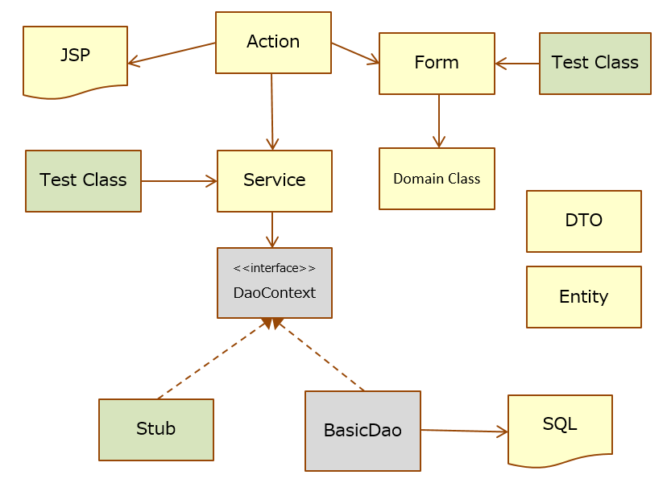

# Application Configuration (Web)

The Web application configuration in this project introduces a class called Service to achieve ease of testing.

- Aggregate business logic into the service class.
- Do not invoke APIs for web application execution infrastructure such as HttpRequest in the service class.
- Allows stubbing of UniversalDao for database access.


  
With this, the following effects can be expected. 
- Service that implements business logic can be tested using class unit test
- Eliminates the requirement to use request unit test saving the effort required for testing


## Action

Nablarch does not have any specific provisions for class configuration from Action onwards. 
The Action responsibilities in the project are determined as follows:

- Validation control
- Calling a service
- Setting values for request scope and session scope
- Forward

Processing other than those mentioned above are performed in other classes (Form or Service) which are described later.


## Form

Receives request parameters and validates input values (no difference with existing Nablarch applications).
However, it is not used for data transfer to JSP for screen output (*1).
DTO is used for such applications.

*1: Except for the exact same Form such as, for restoring input items during validation errors, for displaying the confirmation screen, etc.

## Service

Implements the business logic.

Avoid using web-dependent classes such as HttpRequest, HttpResponse and Form.
Also, do not use ExecutionContext. 
Instead of these classes, the DTO for these Services are received as an argument. 
This maintains the testability of the Service class.

For database access, ensure that UniversalDao can be replaced during the class unit test. 
Since the UniversalDao class has only static methods, use the interface DaoContext.


``` java
public class MyService {

    private final DaoContext universalDao;
     
    public MyService() {
        this(DaoFactory.create());
    }
    /** Test constructor */
    MyService(DaoContext universalDao) {
        this.universalDao = universalDao;
    }
}
```

``` java
DaoContext stub = new DaoContextStub() {
    @Override
    public T findByPk(int id) {
        return (T) new Foo("ふー");
    }
}
```

Though database access can be replaced even by introducing a DAO (Data Access Object) class,
it takes time to create a DAO class, due to which, we replaced the DaoContext implementation.

## Entity

Entity is automatically generated from the ER diagram using the GSP plugin.

## DTO

Used for data transfer processing.
