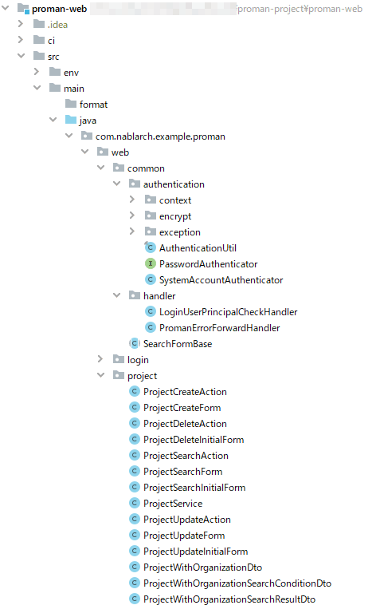

# Project・Package Configuration

## Project Configuration
This project management system consists of following three projects.

```
`-proman-project/
  |-proman-common/     : common project
  |-proman-batch/      : batch-processing project
  |-proman-web/        : screen-processing project
  :
```
Common project deploys base components and common components (common components in the system, common components in the subsystem) that do not depend on the processing method.
Then, common project is configured to be referenced from the project for each processing method such as screen and batch.

The customer management system consists of a single project because the processing method is Web services only.

## Package Configuration

### Package Configuration for common Project

The packages in the common project consist of the following hierarchy.

| Package hierarchy | Description                               |  Example:                   |
| ----------------- | ----------------------------------------- | --------------------------- |
| 1～3              | Identifier representing the system        | com.nablarch.example(fixed) |
| 4                 | Identifier representing subsystem         | proman、climan              |
| 5                 | Identifier representing the common module | web、batch、common、rest    |
| 6                 | Identifier that classifies each component | login, project, etc         |


### Package configuration of the project for each processing method

The project packages for each processing method consist of the following hierarchies.

| Package hierarchy | Description                        | Example:                    |
| ----------------- | ---------------------------------- | --------------------------- |
| 1～3              | Identifier representing the system | com.nablarch.example(fixed) |
| 4                 | Identifier representing subsystem  | proman、climan              |
| 5                 | Identifier representing the module | web、batch、common、rest    |
| 6                 | Identifier representing function   | login, project, etc         |

For identifiers representing modules in the fifth tier, use an identifier that represents either common or processing method.
Under the common package, you place the underlying components used in the processing method and the common components within the subsystem.  
Common components within subsystems are also placed in the common project, but they are also placed when referencing common components from other subsystems or processing methods.
Common components within a subsystem that are used only within a project of one processing method are placed in the common package within that project.

The sixth tier is created for each function, packages that represent class responsibilities (Action, Form, etc.) are not used.  
Place the in-function common components in this package.

An example of class placement is shown below.

