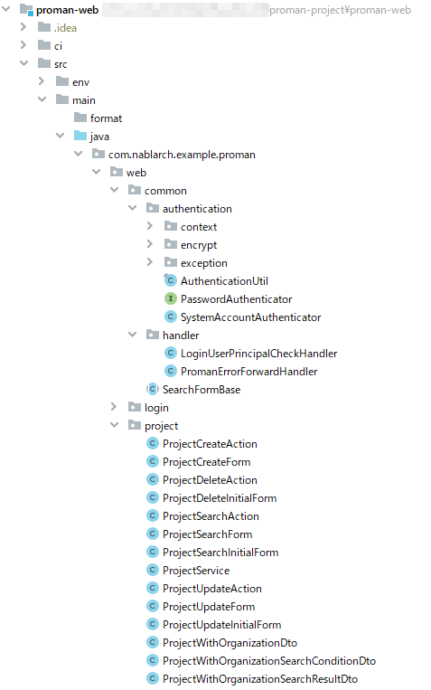

# Project・Package Configuration

## Project Configuration
The project management system consists of following three projects.

```
`-proman-project/
  |-proman-common/     : project for common
  |-proman-batch/      : project for batch application
  |-proman-web/        : project for Web application
  :
```
Common project deploys base components and common components (System-wide components, Subsystem-wide components) that do not depend on the processing architectures.
Then, common project is configured to be referenced from the project for each processing architectures such as project for web application and batch.

The customer management system consists of a single project because the processing architectures is Web services only.

## Package Configuration

### Package Configuration for common Project

The packages in the common project consist of the following hierarchy.

| Package hierarchy | Description                               |  Example:                   |
| ----------------- | ----------------------------------------- | --------------------------- |
| 1～3              | Identifier representing the system        | com.nablarch.example(fixed) |
| 4                 | Identifier representing subsystem         | proman、climan              |
| 5                 | Identifier representing the common module | web、batch、common、rest    |
| 6                 | Identifier that classifies each component | login, project, etc         |


### Package configuration of the project for each processing architectures.

The project packages for each processing architectures consist of the following hierarchies.

| Package hierarchy | Description                        | Example:                    |
| ----------------- | ---------------------------------- | --------------------------- |
| 1～3              | Identifier representing the system | com.nablarch.example(fixed) |
| 4                 | Identifier representing subsystem  | proman、climan              |
| 5                 | Identifier representing the module | web、batch、common、rest    |
| 6                 | Identifier representing function   | login, project, etc         |

For identifiers representing modules in the fifth hierarchy, use an identifier that represents either common or processing architectures.
Under the common package are the base components used by the processing architectures and then places a subsystem-wide's common component too.
The common project may have Subsystem-wide components like a common package. Place it in the common project when referencing it from other subsystems or processing architectures.
System-wide components within Subsystem-wide components that are used only within a project of one processing architectures are placed in the common package within that project.

The sixth hierarchy is created for each function, packages that represent class responsibilities (Action, Form, etc.) are not used.  
Place the Function-wide components in this package.

An example of class placement is shown below.

