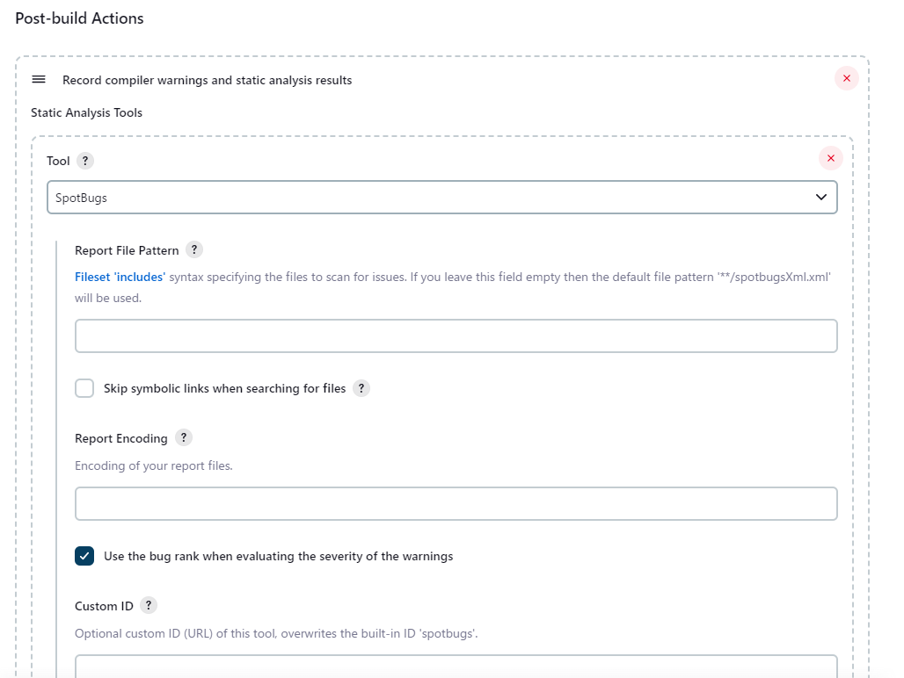

# Method to Collect SpotBugs Execution Results in Jenkins

This document guides how to collect execution results of SpotBugs after building a project with Jenkins.

The contents of this document have been verified with Jenkins 2.401.1 and Warnings Next Generation Plugin 10.2.0

## Install Warnings Next Generation Plugin on Jenkins

First install the Warnings Next Generation Plugin on Jenkins.

Open "Manage Jenkins" from the menu and select "Plugins" under "System Configuration".

Search for "Warnings Next Generation Plugin" in "Available plugins", check "Warnings Next Generation Plugin" and click "Install without restart".

## Collect the check results

Open the job's "Configure" and add "Invoke top-level Maven targets" to "Build Steps".
Add `spotbugs:spotbugs` to your "Goals" to create a check result.

When checking, it must be done after building, so if you build the project with `package`, the value configured in the "Goals" will be `package spotbugs:spotbugs`.

Add "Record compiler warnings and static analysis results" to "Post-build Actions" to collect check results.
Select "SpotBugs" in "Tool" to collect SpotBugs check results.

This completes the configuration for collecting check results.
Check results will now be collected when build is implemented.

When the check results are collected, you will see "SpotBugs Warnings" in the menu.
Open "SpotBugs Warnings" to see the details of the latest results and the history of violation counts.

