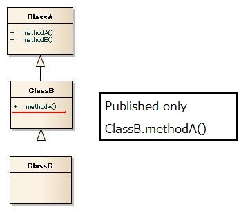
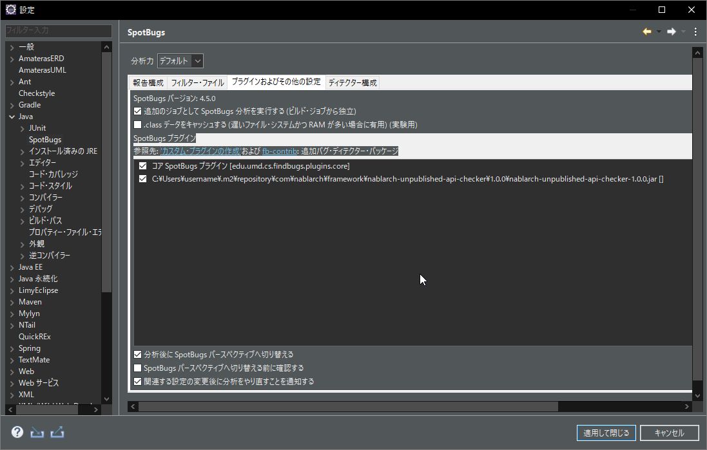

# Unauthorized API Check Tool

This section describes the specifications and usage of the unauthorized API check tool.

## Summary

This is a tool to check whether any APIs, other than authorized API that are specified in the Java coding conventions are used.

By limiting the APIs that can be used, implementations with security issues can be suppressed.

## Specifications

As the specification of the authorized API is described with whitelist format in the configuration file, it can be customized according to the coding conventions of the Nablarch implementation project.

Authorized APIs are specified in the configuration file. 
The configuration file description method will be described later.

Calls to APIs other than the authorized API are checked according to the following rules.

- Reference to unauthorized classes (instantiation, call of class method)
- Calling unauthorized methods
- Supplementing and throwing unauthorized exceptions

Authorized API can be specified in the configuration file as given below.

- Package
- Class or interface
- Constructor or method

This tool is provided as a SpotBugs plugin. 
In other words, its usage is the same as regular SpotBugs as explained below.

- Run as Eclipse Plugin
- Run using Maven

Results can be checked like any other SpotBugs bug reports.

The bug codes and types provided in SpotBugs, for the unauthorized API check, are as follows.

- Bug code ： `UPU`
- Bug type ： `UPU_UNPUBLISHED_API_USAGE`

### Check specifications for inheritance and interface implementation

Check specifications for inherited methods and methods defined in the interface are different from normal check specifications. 
This section describes the check specifications for inheritance and interface implementation.

The following shows the check specifications when `SubClass` inherits `SuperClass`.

```java
List<String> list = new ArrayList<>();
list.add(test); // Check that the add method of List interface is authorized (Not ArrayList class)

SuperClass varSuper = new SubClass();
varSuper.testMethod(); // Check that the SuperClass.testMethod is authorized

SubClass varSub = new SubClass();
varSub.testMethod(); // Check that the SubClass.testMethod() is authorized
```

When the API corresponding to the class/interface is not defined, the parent class or interface is searched sequentially from the one closest to the own class. 
When a class in which the API is defined is first found, it is determined whether the methods of the class are authorized.

As an example, inheritance relationship shown below can be considered.



Whether it can be used is as follows.

```java
ClassC hoge = new ClassC();
hoge.methodA(); // Available
hoge.methodB(); // Not available
```

## How to set up

This section describes how to deploy and describe the configuration file of this tool.

### Configuration file deployment method

Multiple configuration files can be deployed in the directory where the configuration files are stored (hereinafter, the configuration file directory). 
The extension of the configuration file should be `config`.

This project contains the following files as configuration files that conform to Java coding conventions.

| Configuration file name                  | Summary                                                                                                                            |
|------------------------------------------|------------------------------------------------------------------------------------------------------------------------------------|
| `JavaOpenApi.config`                     | APIs that can be used by the Java standard library specified by Nablarch                                                           |
| `JakartaEEOpenApi.config`                | APIs that can be used by the Jakarta EE standard library specified by Nablarch                                                     |
| `NablarchApiForProgrammer.config`        | Nablarch Application Framework APIs for programmers (APIs required for implementing business functions)                            |
| `NablarchApiForArchitect.config`         | Nablarch Application Framework APIs available for architects (APIs that are required to be used for NAF function extensions, etc.) |
| `ProjectOpenApi.config`                  | APIs declared in this project                                                                                                      |

Nablarch also provides `NablarchTestingApiForProgrammer.config` and `NablarchTestingApiForArchitect.config`, which are settings for the testing framework. 
However, this project does not check for unpublished APIs in the testing code.

These configuration files are located as follows.

```
<Workspace>
├─proman-project
│  │  ├─tools
│  │  │   ├─staticanalysis
│  │  │   │  ├─production（configuration files directory for production code）
│  │  │   │  │  ├─ JavaOpenApi.config
│  │  │   │  │  ├─ JakartaEEOpenApi.config
│  │  │   │  │  ├─ NablarchApiForProgrammer.config
│  │  │   │  │  ├─ NablarchApiForArchitect.config
│  │  │   │  │  └─ ProjectOpenApi.config
```

### Configuration file description method

Describe one unauthorized API for each line of the configuration file. 
The description order does not matter.

An example of the configuration file is shown below.

```
java.lang
nablarch.fw.web
nablarch.common.code.CodeUtil
java.lang.Object
java.lang.Boolean(boolean)
java.lang.StringBuilder(java.lang.String)
nablarch.fw.web.HttpResponse.HttpResponse()
java.lang.String.indexOf(int)
nablarch.core.validation.ValidationContext.isValid()
nablarch.fw.web.HttpResponse.write(byte[])
nablarch.fw.web.HttpRequest.setParam(java.lang.String, java.lang.String...)
```

The configuration file can specify APIs that you want to authorize at the package, class, interface, constructor, and method levels.

#### Specified level: Package

Setting to authorize all APIs included in the specified package. (including APIs of sub-packages) 

```
// Example
// When authorizing those under java.lang
java.lang
// When authorizing those under nablarch.fw.web
nablarch.fw.web
```

#### Specified level: Class, interface

This is the setting to authorize all APIs included in the specified class or interface.

Write the fully qualified name of the class.

```
// Example
// To authorize all CodeUtil functions
nablarch.common.code.CodeUtil
// To authorize all Result.Success functions
// Success is a nested class of Result
nablarch.fw.Result.Success
```

#### Specified level: Constructor, method

Setting when authorizing the specified constructor or method.

Write the fully qualified name of the constructor or method.
Write the fully qualified name of even the reference type argument.

```
// Example
// For constructor
java.lang.Boolean.Boolean(boolean)
java.lang.StringBuilder.StringBuilder(java.lang.String)
nablarch.fw.web.HttpResponse.HttpResponse()

// In the case of method call
java.lang.String.indexOf(int)
nablarch.core.validation.ValidationContext.isValid()
nablarch.fw.web.HttpResponse.write(byte[])
nablarch.fw.web.HttpRequest.setParam(java.lang.String, java.lang.String...)

//*******************************************************************
// In the case of nested class constructor
//*******************************************************************
// In the case of nested class, note that the description method is different from the fully qualified name.
// An example of description in the case of a nested class is shown below. 

// For constructor
// If you want to authorize a no-arg constructor where Success is a nested class of Result class,
// Set the constructor name as "Result.Success ()". 
// * Note that when set to nablarch.fw.Result.Success.Success(), 
// the constructor of Result.Success class cannot be used.  
nablarch.fw.Result.Success.Result.Success()
// In the case of constructor with arguments
nablarch.fw.Result.Success.Result.Success(java.lang.String)

// In the case of method call
nablarch.fw.Result.Success.Result.getStatusCode()
```

## Used as Eclipse Plugin

In this section, the setting and check result confirmation method, when using as an Eclipse Plugin are explained.

### Install SpotBugs Eclipse plugin

Install SpotBugs Eclipse plugin from the eclipse marketplace.

- [SpotBugs Eclipse plugin](http://marketplace.eclipse.org/content/spotbugs-eclipse-plugin)

### Set Unauthorized API Check Plugin

Open SpotBugs item from the Eclipse settings.

Open the "Plugin and misc. Settings" tab and press the "Add" button. 
Select `nablarch-unpublished-api-checker-<version>.jar`.

`nablarch-unpublished-api-checker-<version>.jar` should be stored in the local repository of Maven. 
The local repository of Maven is the `.m2\repository` directory under the home directory.
※If you don't have `nablarch-unpublished-api-checker-<version>.jar` in your local repository, please [Run using Maven](#run-using-maven) first.



### Specify the configuration file directory

Modify the `eclipse.ini` file in the Eclipse home directory.

Write `-Dnablarch-findbugs-config=<absolute path of test code configuration file directory>` below `-vmargs` as shown in the following example.

```
-vmargs
-Dnablarch-findbugs-config=C:/nablarch/workspace/example/spotbugs/published-config/production
```

After completing the above settings, restart Eclipse.

### Perform bug checks and check results

Right-click the project and select "Find Bugs" from the SpotBugs menu to perform the bug check.

You can confirm the check results in the bug mark that appears on the left side of the editor or in the SpotBugs perspective.

A limitation of Eclipse is that checks cannot be performed according to the classification of production code and test code, for architects and programmers. 
Therefore, please check according to the classification with CI.

## Run using Maven

Refer [How to run SpotBugs with Maven](../spotbugs/docs/Maven-settings.md).
