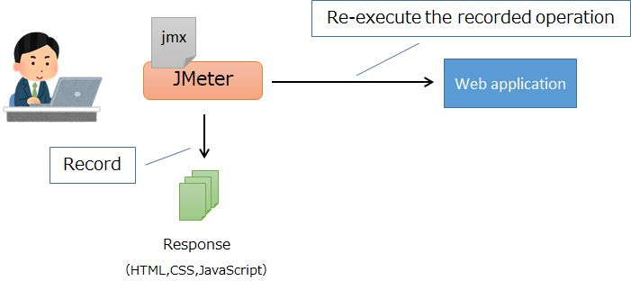
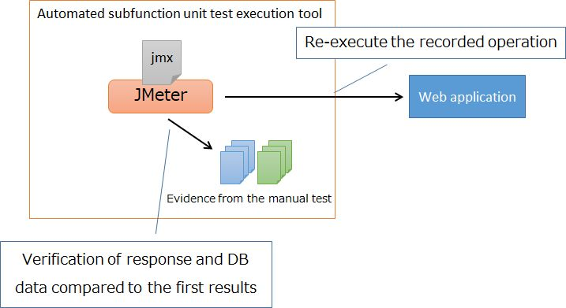

# Test Method of Subfunction Unit Test (Web)

## First manual test
This section describes the procedure for performing the manual subfunction unit test on the first.  
For an overview of subfunction unit testing, see [Regression testing for subfunction unit tests](Unit_test_concept_(Web).md#Regression-testing-for-subfunction-unit-tests).  
For the initial setup procedure of the tools used below, please refer to the [Development Environment Construction Guide](../Development_environment_construction_guide.md) for initial setup instructions for the tools used below.

### Record browser operations and evidence

#### Prepare test data
Prepare the test data to be used in the manual test.

The unit test data dump tool has a feature that inserts the dumped data back into the DB.  
Therefore, if the data used in the test is extracted in advance by the dump tool, the same data can be used for subfunction unit tests again and again using the dump tool's insert function.

The steps to create the test data for the insert are described below.

First, put the DB in a state just before the test.
Then, use the dump tool to get a dump of the DB before testing.
Please refer to [How to Get Evidence (Log and DB Dump)](How_to_get_evidence_(log_and_DB_dump).md) for how to get the dump.

After the dump file is created, you can create a file for test data registration using the following procedure.

1. Open the Dump Tool Excel file (DUMP.xlsm) and update the list of table definitions (see [How to Get Evidence (Log and DB Dump)](How_to_get_evidence_(log_and_DB_dump).md) for instructions.).
2. Open the MAIN sheet and change the Insert column to "○" for the table you want to insert data into.
3. Open the dump file from which the state just before the test was extracted and copy the table to be inserted into the INSERT sheet of DUMP.xlsm. (See the INSERT sheet for the contents of the instructions. (See 使い方.xlsx (usage.xml) for information on what to include in the INSERT sheet.

This completes the preparation of the test data registration.

#### Registering Test Data
1. Open DUMP.xlsm with test data in the INSERT sheet, and click "(起動)Start" at the top of the MAIN sheet screen.
2. The window of Dump tool is displayed. Click on "インサート(Insert)" in the displayed window.

#### Recording requests in JMeter
Use JMeter's "HTTP(S) Test Script Recorder" to record requests during the manual test.  

1. Copy the [Test-Plan-template.jmx](Subfunction_Unit_Test_Tool/Test-Plan-template.jmx) for each test scenario and rename it to your desired name.
1. Launch JMeter with the [start-up-jmeter.bat.bat(JMeter-startup-batch.bat)](Subfunction_Unit_Test_Tool/start-up-jmeter.bat.bat) that you have configured for your environment.
1. Open the jmx file created in step 1 in JMeter.
1. Select "User Defined Variables" on the left side of the screen and change `localhost` set as the value of `server.host` to your terminal's IP address.
  - By setting the IP address of your terminal in `server.host`, the server name of the request recorded below becomes a placeholder named `${server.host}`. This allows you to switch the address of the server you are connecting to at once by changing the value of `server.host`.
1. select "HTTP(S) Test Script Recorder" on the left side of the screen and click the "Start" button.
1. Install a dummy certificate for the proxy.
    - Double-click the `ApacheJMeterTemporaryRootCA.crt` which will be generated under the bin directory where you extracted the JMeter.
    - Go to "証明書のインストール(Install Certificates)" -> "現在のユーザー(Current User)" -> "証明書を全て次のストアに配置する(Place All Certificates in Next Store)" and select "信頼されたルート証明機関(Trusted Root Certification Authority)" to install.
    - The certificate is set to expire in 7 days, so you should do this every time it expires.
1. Open the browser with the Chrome shortcut that has been set to use JMeter as an HTTP proxy server, and access the IP address of your terminal to perform a subfunction unit test. (Start from the login operation)
    - Be sure to launch a new window from the Chrome shortcut for each scenario.
      - Once launched, the cache retrieved in the first request is used. Therefore, if multiple scenarios are recorded in the same window in succession, the second and subsequent scenarios will not include requests to retrieve CSS and JavaScript.
    - After the login screen is displayed, go to [Test Plan] > [Thread Group] > [Recording Controller] and confirm that the line has increased and the request has been recorded.
        - Please access with your device's IP address, because accessing with `localhost` will cause the browser to bypass the proxy even if it is set.
        - If there are no more lines of requests in the "Recording Controller" section, the proxy settings are probably wrong.
        - If the above doesn't help, please check the jmeter.log which should be saved in the same location as the "start-up-jmeter.bat" used to start JMeter.
1. Stop JMeter's HTTP proxy server after completing the necessary operations in one test scenario.
1. Select "User Defined Variables" on the left side of the screen and change the value of `server.host` to `localhost`.
1. Save the "Test Plan".

#### Get a hard copy of the screen

1. Launch the Window Size Tool (Sizer).
1. Launch the browser.
1. Place mouse cursor on the bottom right corner of browser and right click.
1. Click on the menu that appears and change to the size of the browser you want to use for testing.
1. A hard copy of the screen is obtained using Chrome's developer tools.
    - If your viewpoint is to check the layout, open the developer tool in a separate window so that the size of the window from which the screen hardcopy is obtained is the size specified in the UI standard.
    - With the developer tools open, press `Ctrl+Shift+P` to display the input window.
    - Type `full` in the input window and press `Enter` when the function "Capture full size screenshot" is displayed. A download window will appear and save a hard copy of the screen to your desired location.

#### Get a DB dump with the dump tool

Use the unit test data dump tool to get a dump from the DB immediately after the manual test.  
See [How to Get Evidence (Log and DB Dump)](How_to_get_evidence_(log_and_DB_dump).md) for specific instructions.

### Recording the response

The response file can be retrieved by rerunning the test plan (jmx file) recorded by [Recording requests in JMeter](#Recording-requests-in-JMeter).  
Basically, you can't pause the test plan while it is rerunning. Do not change the DB state during the test.

1. Open the "テスト計画 (test plan)" (jmx file) created in [Recording requests in JMeter](#Recording-requests-in-JMeter) in JMeter.
2. Set the DB to the state before the test is executed. Please refer to [Registering Test Data](#Registering-Test-Data) for the procedure.
3. Press the 実行(Run) button at the top of the screen.
   - Make sure that the HTML, CSS and JavaScript files are output in the same location as the "Test Plan" (jmx file).
     - If it has not been created, check the contents of jmeter.log that is output to the same position as the "start-up-jmeter.bat" used to start JMeter.
     - If the file has already been Recorded, an error will occur. Move or delete the file and then execute it again.
4. Please check the status of the DB and the output response to see if the results are as expected.

#### Response file
HTML, CSS and JavaScript files will be output in the same location as the "Test Plan" (jmx file).

The HTML file obtained here is used to confirm that the response has not changed in the assertion of the automatic test.
Can't check the look and feel of the HTML file by opening it directly in the browser because the CSS is not applied.  
The visual check should be done visually when recording the test in JMeter and a hard copy of the screen should be saved.

The reason why CSS and JavaScript are recorded even though the appearance can not be confirmed is "If you save the CSS and JavaScript at the time of visual confirmation and the same file is also returned in the regression test, on the browser The result can be said to be the same”.

Note that the output HTML file has a different value for the double-submit token than the original.
This is because the value of the double-submit token is a value that changes each time it is used, and we do not want unnecessary differences in this value when run regression tests.

## Store evidence and response
Various evidence and response files and "Test Plan" (jmx files) obtained during the firsst manual test should be stored according to `/Sample_Project/Design_Document/A1_Project_Management_System/020_Architecture_Design/020_Development_Standards/020_Test_Standards`, `3.3.4. How to store evidence`.

Also, if you use the AutoRunning Tool for subfunction unit tests to perform regression testing, you will need to edit some files for the AutoRunning Tool.  
For more information, please refer to the AutoRun tool's [README](../../../Source_Code/proman-project/proman-jmeter/README.md) in the runtime tool.
For more information, please refer to the "How to create a test scenario" section of the AutoRun tool's [README](../../../Source_Code/proman-project/proman-jmeter/README.md).

## Second and subsequent automated tests

A mechanism is provided to automatically execute a subfunction unit test using the evidence and test plan recorded in the first manual test.  
For details, see [Test Method of Subfunction Unit Test (Web)](Test_method_of_subfunction_unit_test_(Web).md).

## Other: Tips for the manual Test
The following is a case-by-case explanation of "what to do in this situation" for subfunction unit tests.

### Testing for "Exclusive control error"

1. Start the app in the IDE
2. Start Chrome (hereinafter referred to as browser A).
3. Select "New incognito window" from the menu of Browser A and start another Chrome window (hereinafter referred to as Browser B).
   Two browsers are opened to prevent sessions from being shared between browsers. 
4. Both browser A and browser B will transition to the update screen with the same data.
5. Confirm with Browser B.
6. Confirm that the screen transitions to a screen indicating that an exclusive control error has occurred when you press Enter on Browser A.

### Testing for "Duplicate form submission error"

1. Start the app in the IDE
1. Start the browser and transition to the screen to be tested.
1. Click the button you want to test in the browser.
1. Return with the back function of the browser.
1. Click the button to test. 
   Since the same token as 2 is sent, you can confirm the duplicate form submission error.

### "Message display (by item)" test

The test of "Unit test specification" → "Subfunction unit (1)" → "Message display (by item)" checks whether the error message is displayed at the appropriate position.    
Variations of errors are not tested for the following reasons.

- Since "if the correct domain is assigned, an appropriate error message will be issued", variations of error is not required to be tested.  
  The review of the form class ensures that the appropriate domain is granted. 
- By checking each item and error message one by one, you can check whether the validation is working.

The correlation check is performed by a unit test.
