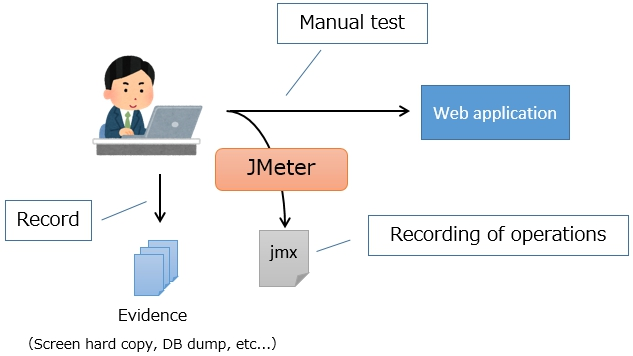

# Unit Test Concept (Web)

The testing methodologies that has been presented in the past at Nablarch has been to leverage a testing framework to automate many parts of the testing.
Although high coverage could be achieved, creating and maintaining test data was particularly labor-intensive.
Due to the above characteristics, it was very effective for large-scale projects, but it was difficult to adopt for projects that required frequent changes or small to medium-scale projects because of the high cost of the quality that had to be guaranteed.

In this project, we will implement a test method that gives importance to the balance between cost and quality.
We minimized the most labor-intensive task of creating and maintaining test data.
However, instead of testing everything manually, we proactively write test code where it is more efficient to do so.

A particular challenge in preparing and maintaining test data was the database.
Changing the table and column names would affect many of the test data. 
Tests that included database access were a factor for slowing the tests.

To address these issues, this project (Web application) does not use [request unit test](https://nablarch.github.io/docs/LATEST/doc/development_tools/testing_framework/index.html).
However, stopping the method that we followed until now may cause a decrease in quality. Therefore, we will make sure to compensate for it with other tests and theoretical confirmation.
The following quality checks are performed in this project before the manufacturing and unit test phase.

- Theoretical confirmation
- Class unit test
- Subfunction unit test

## Confirmation method for each deliverables
Describes the deliverables  created by the developer and how to test them.

| Deliverables         | Theoretical | Class | Subfunction  |
|----------------|------|--------|------|
| Action         |      |        | X    |
| Form           | X    | X      | X    |
| Domain class | X    |        | X    |
| Service        |      | X      | X    |
| SQL file    | X    |        | X    |
| Entity         |      |        | X    |
| DTO            |      |        | X    |
| JSP            |      |        | X    |
| routes.xml     |      |        | X    |


### Action

In Action class, the operation is manually checked with the subfunction unit test.

The Action test was usually performed in the request unit test,
but since it can be confirmed with the subfunction  unit tests other than business logic, we will confirm it manually.
- Validation control (can be confirmed by displaying an error)
- Calling a service (can be confirmed with processing results such as screen display and DB)
- Value setting for request scope and session scope (can be confirmed with screen display) 
- Forward (can be confirmed with screen display)

Business logic is not included in Action as it is implemented by the Service class described below.

### Form

#### Confirmation of form annotation

Confirms that the annotation of the form field is as described in the design document. 
(Required Annotation and Domain Annotation)
Compare the design document with the source code of the form and check it visually.


Assignment of annotation is declarative, and bugs cannot be detected efficiently by writing test code.
For example, the procedure to write a test is as follows:

- Set null to the mandatory items of Form
- Implement validation
- Confirm that a mandatory error occurs

However, when writing such code, see the design document and read that the item is mandatory, then write the code as mentioned above. 
In this case, even the method of virtually comparing the design document and source code of the Form and confirming that the correct annotation has been assigned is the same as doing it practically, and is far more efficient.

Since specific logic and values (maximum value and minimum value) are not included when assigning annotations, 
no errors except for spelling mistakes are introduced at the programming stage. 
(Spelling errors can be checked using compilers and tools, and testing is not required)


#### Confirmation of validation logic

In addition to required and domain annotations, if validation logic is written using `@AssertTrue`, etc., 
then it will be targeted for class unit test.

### Domain class

This class holds the domain definition and creates a domain definition design form.

When a domain class is created from the domain definition design document, there is a possibility of incorrect definitions (for example, the maximum digit is copied incorrectly).
Check by theoretical review as it is inefficient to write a test code based on limit value analysis for detecting the error. 


### Service

Service describes the so-called business logic.
Avoid using Nablarch APIs such as HttpRequest and ExecutionContext.

Although Universal Dao is used for database access, use (depend on) the DaoContext interface instead of using the UniversalDao class.
Since it depends on DaoContext interface instead of UniversalDao class with static method, stubbing database access becomes easy.


``` java
public class MyService {

    private final DaoContext universalDao;
     
    public MyService() {
        this(DaoFactory.create());
    }
    /** Test constructor */
    MyService(DaoContext universalDao) {
        this.universalDao = universalDao;
    }
}
```

``` java
DaoContext stub = new DaoContextStub() {
    @Override
    public T findByPk(int id) {
        return (T) new Foo("ふー");
    }
}
```

Using a mock library as a method of changing the behavior of UniversalDao for every test case was also considered, 
but this project did not use a mock library for the following reasons:

- Troubleshooting is difficult when the expected operation is not performed (particularly during the maintenance phase after the architect leaves)
- Backward compatibility may not be feasible due to version upgrade (ex: JMockit)


### SQL file

It is necessary to consider SQL in the design phase, but if you design SQL theoretically, there is a problem that quality cannot be sufficiently ensured. 
For this reason, it is assumed that the design will be carried out while testing with SQL, and the SQL file is created at the same time.
 (This SQL file will be input to the Programming and Unit testing phase)

SQL Executor is the tool used to test SQL. 


### Entity

As it is automatically generated by the GSP plugin, it is excluded from the class unit test.

### DTO

DTO is excluded from the class unit test as it does not contain any logic and the accessor is automatically generated by the IDE.

### JSP

Checks with the subfunction unit test as usual.


### routes.xml

Routing mistakes are easy to identify with manual tests, so check them with the subfunction unit test.


## Regression testing for subfunction unit tests
Subfunctionunit testing is done by manual only the first time to reduce the burden of regression testing, and the second and subsequent tests are automated using an automated testing tool.

The following is an overview of the steps.  
For a detailed explanation of each procedure, see [Test Method of Subfunction Unit Test (Web)](Test_method_of_subfunction_unit_test_(Web).md).

### 1. First time manual test
#### 1-1. Record browser operations and evidence


First of all, test manually for the first time.

At this time, use the "HTTP(S) Test Script Recorder" function of Apache JMeter to record the operations performed by the browser.
The operation record is saved as a jmx file, which is a JMeter test plan file.

Also, at this time, manually record evidence such as a hard copy of the screen or a database dump.

#### 1-2. Recording the response


Execute the recorded jmx file and record the response file (HTML, CSS and JavaScript).

### 2. Second and subsequent automated tests


The second and subsequent regression tests will use a tool that automatically runs the subfunction unit tests.

By placing the jmx files, evidence and response files recorded during the first manual test into a designated directory in the automated test tool, subfunction unit tests can be run automatically.

This reduces the cost of regression testing.
