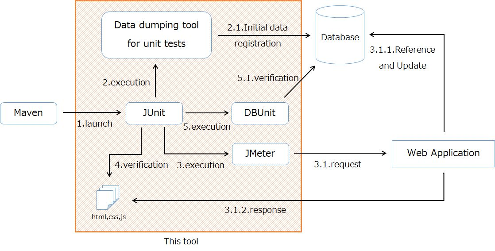

# proman-jmeter
This tool is designed to automatically run trade unit tests using JMeter.

Initially, it is configured to allow you to run tests against the sample project's project management system.  
For information on how to run test scenarios against a project management system, see [Test Method of Subfunction Unit Test (Web)](../../../Sample_Project_Development_Guide/PGUT_Phase/ut/Test_method_of_subfunction_unit_test_(Web).md).

This section explains how this tool works and how to use it.

## Operating environment
It is assumed that the following software is installed in the execution environment.
* Java Version : 8
* Maven 3.6.1 or later
* PostgreSQL 10.4.1 or later

### Supported databases
Currently, only PostgreSQL is the only database that has been confirmed to work.  
For other database products, the unit test data dump tool used for data registration may not work properly.

## Assumptions and Constraints
### No HIDDEN cryptography for double-submit tokens
A feature in Nablarch exists to encrypt double submit tokens with HIDDEN encryption.  
If this feature is enabled, the execution of the request by JMeter will fail.

Therefore, you should not use the HIDDEN encryption feature of the double submit token when using this tool.

To disable the HIDDEN encryption feature, please refer to [Encryption of data held in the client (hidden encryption)](https://nablarch.github.io/docs/LATEST/doc/en/application_framework/application_framework/libraries/tag.html#tag-hidden-encryption).


### Elements that change at each execution
An assertion will fail if there is an element that changes the result each time it is executed.  
This includes, for example, the following cases.

- Outputs the execution date and time on the screen.
- Columns that record sequence numbers and modification dates in database tables.

In the case of outputting on screen, you need to mock the part only during testing (outputting a fixed value).  
If your application can support this, please mock it.  

If it is difficult to mock, refer to [Exclude certain items from validation when creating a response file](#Exclude-certain-items-from-validation-when-creating-a-response-file).

If there are columns in the database, you need to exclude them from the validation.  
For information on how to exclude certain columns from validation, see [Excluding certain columns from validation](#Exclude-certain-columns-from-validation).

## Structure
### Overall picture


1. This tool is built in JUnit and runs in Maven's `test` phase.
2. First, register the initial data in the database using a unit test data dump tool.
3. Next, run the test scenario using JMeter.
4. Verify that the HTML and other files returned by the application are as expected.
5. Finally, we use DBUnit to verify that the state of the database is as expected.

### Directory layout
```
proman-jmeter/
 |-log/
 |-target/
 | |-test-classes/
 | :
 `-src/test/
   |-java/
   `-resources/
```

| directory             | explanation                                                                       |
| --------------------- | --------------------------------------------------------------------------------- |
| `log`                 | The log of this tool is output.                                                   |
| `target/test-classes` | The response at the time of the test run is output under each scenario directory. |
| `src/test/java`       | The source of this tool is stored here. You will not touch the source below this. |
| `src/test/resources`  | It contains test scenarios and configuration files.                               |

### Test scenario
A single test run in JMeter is called a **Test scenario**.  
A test scenario consists of a single jmx file (JMeter's test plan file) and a number of data files.

Put the test scenario under `src/test/resources` as follows.

```
src/test/resources
 |-[subfunction ID]
 : |-[scenario ID]   * Each of these directories is a test scenario
   |-[scenario ID]
   : 
```

The `[subfunction ID]` and `[scenario ID]` should be set according to the trade unit test specification.

Then, the directory structure of each test scenario should be as follows.

```
[シナリオID]
 |-scenario/
 | `-[scenario name].jmx
 |
 |-db_dump/
 | |-INSERT.xlsm
 | `-EXPECTED.xlsx
 |
 |-response/
 |-input/
 |-output/
 |-log/
 `-hard_copy/
```

#### scenario/[scenario name].jmx
This is a test plan file for JMeter.  
Please set an easy to understand name for `[scenario name]`.

#### db_dump/INSERT.xlsm
This is an Excel data file for the data dumping tool for unit tests.  
The data to be registered in the database should be set up before JMeter is executed.

#### db_dump/EXPECTED.xlsx
This is an Excel file in which you set up the data to be verified by DBUnit after JMeter is executed.

DBUnit validation will only be performed when this file is in place.

#### response/
This section contains the HTML, JS, and CSS files of the response obtained from the first manual test.  
After running JMeter, this file and the actual response are compared and verified.

#### input/
The data (other than the database) that becomes the input of the process to be tested is stored.  
It is not used in this tool.

#### output/
Stores files, emails, forms, and other items that are output from the subfunction test.  
It is not used in this tool.

#### log/
This is a directory to save the logs of the application and other data when you perform a manual test.  
It is not used in this tool.

#### hard_copy/
This is the directory where the hard copy of the screen is saved when you perform a manual test.  
It is not used by this tool.

### configuration file
The `src/test/resources/env.properties` is the configuration file for the tool.  
With this configuration file, you can configure the application server to be tested, database connection information, and so on.

The following is a description of each setting item.

#### jmeter.home
Set up the JMeter installation directory on the environment where this tool is running.  
Make sure that the JMeter `bin` directory, etc. is under the directory set here.

**Configuration example**

```properties
jmeter.home=C:\\tools\\apache-jmeter-5.2.1
```

#### server.host
Configure the host information (host name or IP address) of the server to be connected by JMeter.

The server information is also configure in user-defined variables in the jmx file.  
However, user variables are overwritten by `server.host` in the `env.properties` when a jmx file is executed from this tool.  
This allows users to change their connections with just `env.properties` without modifying the jmx file.


**Configuration example**

```properties
server.host=demo-server
```

#### server.port
Configure the port number of the server to be connected by JMeter.

Like `server.host`, the user-defined variables in the jmx file will be overwritten by these values.

**Configuration example**

```properties
server.port=80
```

#### response.encoding
Configure the character code to be used when reading the contents of the response file.

**Configuration example**

```properties
response.encoding=UTF-8
```

#### database.driver
Configure the fully qualified name of the JDBC driver to be used for the database connection.

This configuration is used by both DBUnit and the data dumping tool for unit tests.

Although the unit test data dump tool allows you to write DB connection configuration in an Excel sheet, the values in the configuration file are used when running from the tool.  
This allows you to switch the database to be connected to by modifying only the `env.properties` without having to edit the Excel sheet for each scenario.


**Configuration example**

```properties
database.driver=org.postgresql.Driver
```

#### database.url
Configure the connection URL for the database.

Like `database.driver`, this configurationis used by DBUnit and the unit test data dumping tool.

**Configuration example**

```properties
database.url=jdbc:postgresql://localhost:5432/postgres
```

#### database.username
Configure the user name to connect to the database.

Like `database.driver`, this configurationis used by DBUnit and the unit test data dumping tool.

**Configuration example**

```properties
database.username=postgres
```

#### database.password
Configure the connection password for the database.

Like `database.driver`, this configurationis used by DBUnit and the unit test data dumping tool.

**Configuration example**

```properties
database.password=password
```

## How to create a test scenario
This section describes the steps to take when creating a new test scenario.

### Create a jmx
Create a JMeter test plan file to run in each test scenario.

The specific steps are [Test Method of Subfunction Unit Test (Web)](../../../Sample_Project_Development_Guide/PGUT_Phase/ut/Test_method_of_subfunction_unit_test_(Web).md), "Recording Requests in JMeter".

Put the jmx files under the `scenario` directory of each scenario directory.

### Create INSERT.xlsm
Create the data to be registered in the database before JMeter is executed.

The specific steps are [Test Method of Subfunction Unit Test (Web)](../../../Sample_Project_Development_Guide/PGUT_Phase/ut/Test_method_of_subfunction_unit_test_(Web).md), "Prepare test data".

Rename the `DUMP.xlsm` file to `INSERT.xlsm` and store it under the `db_dump` directory of each scenario directory.

### Create EXPECTED.xlsx
Create the expected data to be validated by DBUnit.

This file is only needed for tests that update the database.  
It is not needed for search-type tests that do not update the database, so go to "Create response file" below.

This data is obtained by dumping the database after the first time manual test by using the data dump tool for unit test.  
For information on how to obtain a database dump using the Data Dump Tool for unit tests, see [How to Get Evidence (Log and DB Dump)](../../../Sample_Project_Development_Guide/PGUT_Phase/ut/How_to_get_evidence_(log_and_DB_dump).md), "How to get evidence".

A dump file obtained by the Unit Test Data Dump Tool cannot be used with DBUnit as is.  
You must make the following edits in order to make it available to DBUnit.

#### Separate the table by sheet
The dump file for the unit test data dump tool outputs all the data of the table to be extracted to one sheet.  
On the other hand, the Excel file used by DBUnit describes the data of one table per sheet.

Therefore, it is necessary to process the file so that it becomes one sheet and one table based on the dump file obtained by the data dump tool for unit test.  
At this time, each sheet should be described by the following rules.

- The sheet name must match the physical name of the table
- The first line should be the physical name of the column
- Enumerate the data after the second line.
- Make the `null` item an empty cell (use bulk replacement, etc.).

It is also recommended that you select the bottom blank line and remove it explicitly, as DBUnit may misidentify it as a data row even if it looks empty if there is still cell formatting and other information.

#### Exclude certain columns from validation
Some columns change their stored value every time they are executed (e.g., columns that are numbered by sequence, or columns that store the date and time of execution).  
If such columns are included in the validation, the test will always fail when it is rerun.  
Therefore, such columns must be excluded from the validation.  
To exclude a particular column from DBUnit's validation, you can remove the column's columns.

Save the modified Excel file with the name `EXPECTED.xlsx`.  
The destination is under the `db_dump` directory of each scenario directory.

### Create response file
In order to compare and verify the response, we create an expectation file.

The expectation file is the result of the first manual test.  

The specific steps are [Test Method of Subfunction Unit Test (Web)](../../../Sample_Project_Development_Guide/PGUT_Phase/ut/Test_method_of_subfunction_unit_test_(Web).md), "Recording the response".

Store the files obtained under the `response` directory of each scenario directory.

#### Exclude certain items from validation when creating a response file

The response file is saved in JMeter's [JSR223 PostProcessor](https://jmeter.apache.org/usermanual/component_reference.html#JSR223_PostProcessor) component.
[JSR223 PostProcessor](https://jmeter.apache.org/usermanual/component_reference.html#JSR223_PostProcessor) to override certain items with fixed values or can exclude it from verification by deleting it.

```groovy
// エビデンスとして使用するファイルには実行ごとに変更される値（二重サブミットトークン）は書き出さない。
// (Do not write out values that change on a run-by-run basis (double submit tokens) to the file used as evidence.)
def responseWithoutNablarchToken = prev.getResponseDataAsString().replaceAll(/(input type="hidden" name="nablarch_hidden" value=")(.*?)(nablarch_token=[^"\|]+)(\|?)(.*?")/, "\$1\$2nablarch_token=TMP_VALUE_FOR_EVIDENCE\$4\$5");
// jsessionid を削除(Remove the jsessionid)
def responseWithoutJsessionId = responseWithoutNablarchToken.replaceAll(/;jsessionid=[a-zA-Z0-9.]+/, "");
```

`String#replaceAll(String regex, String replacement)` replaces the response with a regular expression.

By using the above method, you can exclude certain items from verification.