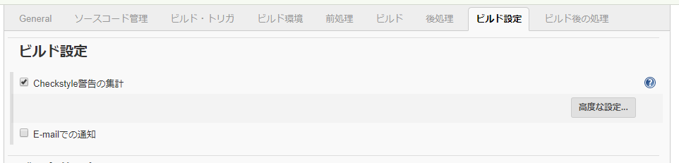
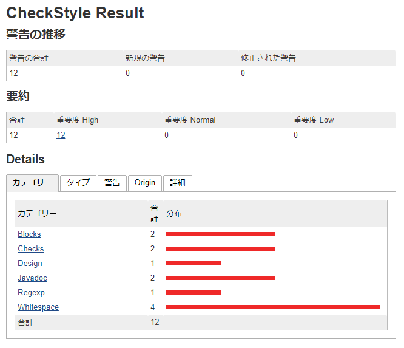
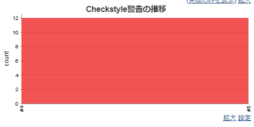
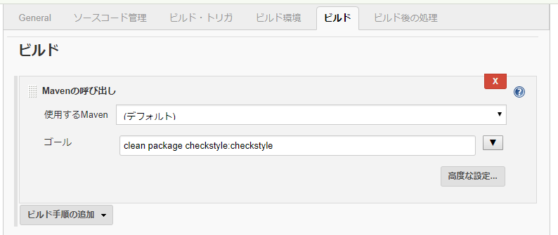

# Method to Collect Checkstyle Execution Results in Jenkins

This document guides how to collect Checkstyle execution results after building a project with Jenkins.

The contents of this document have been verified with Jenkins 2.121.1 and Checkstyle Plug-in 3.50.

## Install Checkstyle plugin on Jenkins

First install the Checkstyle plugin on Jenkins.

Open Jenkins, on the menu go to "Manage Jenkins" then to "Manage plug-ins" and open the "Available" tab.

Select "Checkstyle Plug-in" and click on "Install without restarting".

## Collect the check results (Maven project)

Open the "settings" of the job.
Add `checkstyle:checkstyle` to "Goals and Options" of the "Build".
If the project is built with `mvn package`, the value configured in the "Goals and Options" will be `package checkstyle:checkstyle`. 

Add a check to "Checkstyle warning summary" in "Build Settings".

This completes the configuration for collecting check results.

Check results will now be collected when build is implemented.
Once the check results are collected, a link called "Checkstyle warning" will be displayed on the job menu.
Follow the link for more details on the warning.

Also, "Progress of Checkstyle warning" is displayed on the top page of the job. 
The status of warnings of each build can be viewed on a graph.

## Collect the check results (freestyle project)

Open the "settings" of the job.
Select "Call Maven" in "Build" and add it. 
Add `checkstyle:checkstyle` to "Goals".
If the project is built with `mvn package`, it will be package `package checkstyle:checkstyle`.

And then select "Add Checkstyle Warnings" in "Post Build Process" and add it.

This completes the configuration for collecting check results.

*Here after it is the same as the Maven project.
