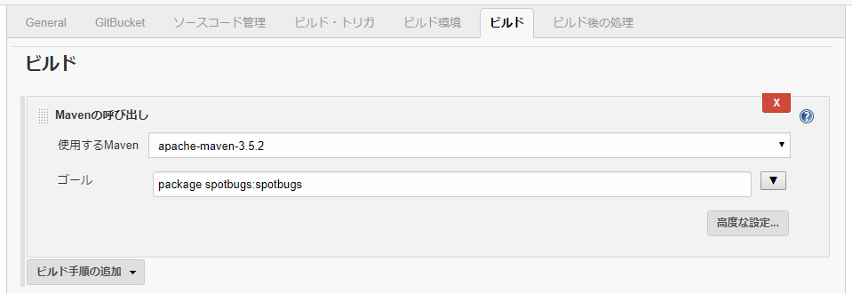
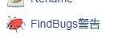
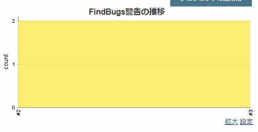

# Method to Collect SpotBugs Execution Results in Jenkins

This document guides how to collect execution results of SpotBugs after building a project with Jenkins.

Jenkins does not have a SpotBugs plugin, but you can use the FindBugs plugin instead.
The check is performed by Maven, and Jenkins only collects the results (XML file), so there is no problem using the FindBugs plugin.

The contents of this document have been verified with Jenkins 2.121.2 and FindBugs Plug-in 4.72

## Install SpotBugs plugin on Jenkins

First install the FindBugs plugin on Jenkins.

Open Jenkins, on the menu go to "Manage Jenkins" then to "Manage plug-ins" and open the "Available" tab.

Select "FindBugs Plug-in" and click on "Install without restarting".

## Collect the check results (freestyle project)

Open the "settings" of the job. 
<<<<<<< HEAD
Select "Call Maven" in "Build" and add it.

Add `spotbugs:spotbugs` to "Goals".
If the project is built with `mvn package`, the value configured in the "Goals" will be `package spotbugs:spotbugs`.

And then select "Aggregate FindBugs Warnings" in "Post Build Process" and add it.

Set the "Files to Collect" to `**/spotbugsXml.xml`.
=======
Select "Mavenの呼び出し(Call Maven)" in "ビルド(Build)" and add it.

Add `spotbugs:spotbugs` to "ゴール(Goals)".
If the project is built with `mvn package`, the value configured in the "ゴール(Goals)" will be `package spotbugs:spotbugs`.

And then select "FindBugs警告の集計(Aggregate FindBugs Warnings)" in "ビルド後の処理(Post Build Process)" and add it.

Set the "収集するファイル(Files to Collect)" to `**/spotbugsXml.xml`.
>>>>>>> 2aecddaa5a1529732d5207d5a08823b5737bb34a

This completes the configuration for collecting check results.

Check results will now be collected when build is implemented. 
<<<<<<< HEAD
Once the check results are collected, a link called "FindBugs warning" will be displayed on the job menu.
=======
Once the check results are collected, a link called "FindBugs警告(FindBugs warning)" will be displayed on the job menu.
>>>>>>> 2aecddaa5a1529732d5207d5a08823b5737bb34a
Follow the link for more details on the warning.

<<<<<<< HEAD
Also, "Progress of FindBugs warning" is displayed on the top page of the job.
=======
Also, "FindBugs警告の推移(Progress of FindBugs warning)" is displayed on the top page of the job.
>>>>>>> 2aecddaa5a1529732d5207d5a08823b5737bb34a
The status of warnings of each build can be viewed on a graph.

