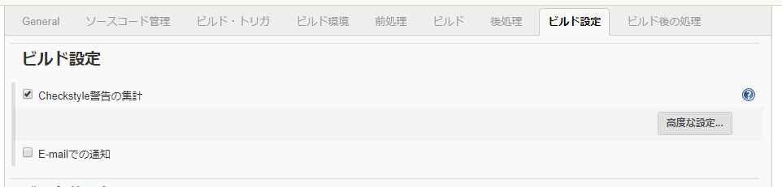
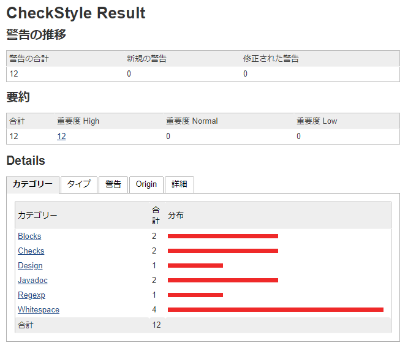
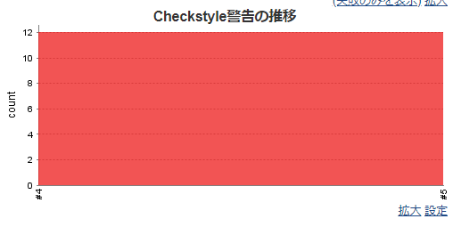
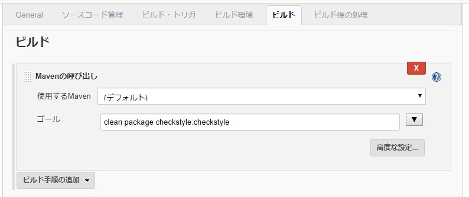
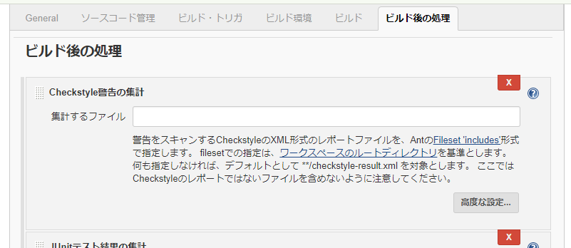

# JenkinsでのCheckstyle実行結果の収集方法

この文書ではJenkinsでプロジェクトのビルドを行った際、Checkstyleの実行結果を収集する方法をガイドします。

なお、この文書の内容はJenkins 2.121.1、Checkstyle Plug-in 3.50で動作検証を行っています。

## JenkinsにCheckstyleプラグインをインストールする

まずJenkinsにCheckstyleプラグインをインストールしてください。

Jenkinsを開いてメニューを「Jenkinsの管理」、「プラグインの管理」と辿って「利用可能」タブを開いてください。

「Checkstyle Plug-in」にチェックを入れて「再起動せずにインストール」をクリックしてください。

## チェック結果を収集する（Mavenプロジェクト）

ジョブの「設定」を開いてください。
「ビルド」の「ゴールとオプション」に `checkstyle:checkstyle` を追加してください。
仮にプロジェクトのビルドが `mvn package` で行われる場合、「ゴールとオプション」に設定する値は `package checkstyle:checkstyle` になります。

それから「ビルド設定」で「Checkstyle警告の集計」にチェックを入れてください。

これでチェック結果を収集するための設定が出来ました。

あとはビルドを実施するとチェック結果が収集されます。
チェック結果が収集されるとジョブのメニューに「Checkstyle警告」というリンクが表示されます。
リンクを辿ると警告の詳細が見られます。

また、ジョブのトップページに「Checkstyle警告の推移」が表示されます。
ビルド毎の警告の推移をグラフで見られます。

## チェック結果を収集する（フリースタイル・プロジェクト）

ジョブの「設定」を開いてください。
「ビルド」で「Mavenの呼び出し」を選択して追加してください。
「ゴール」に `checkstyle:checkstyle` を追加してください。
仮にプロジェクトのビルドが `mvn package` で行われる場合は `package checkstyle:checkstyle` になります。

それから「ビルド後の処理」で「Checkstyle警告の集計」を選択して追加してください。

これでチェック結果を収集するための設定が出来ました。

※以降はMavenプロジェクトと同様です。
