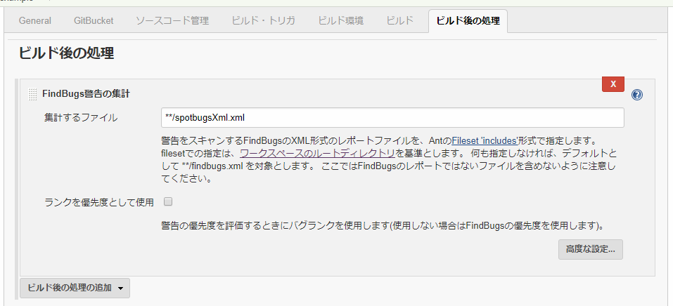
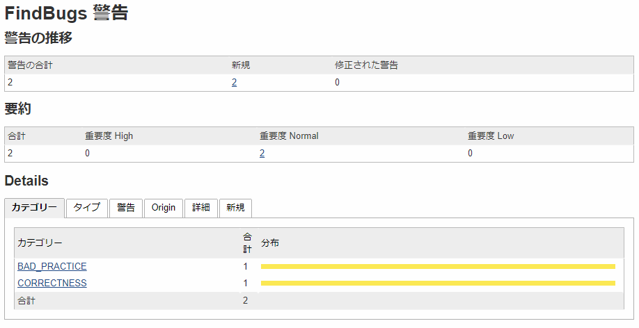

# JenkinsでのSpotBugs実行結果の収集方法

この文書ではJenkinsでプロジェクトのビルドを行った際、SpotBugsの実行結果を収集する方法をガイドします。

JenkinsにはSpotBugsプラグインがありませんが、代わりにFindBugsプラグインを使用できます。
チェック自体はMavenで実施して、Jenkinsでは結果（XMLファイル）の収集を行うだけなのでFindBugsプラグインを使用しても問題ありません。

この文書の内容はJenkins 2.121.2、FindBugs Plug-in 4.72で動作検証を行っています。

## JenkinsにSpotBugsプラグインをインストールする

まずJenkinsにFindBugsプラグインをインストールしてください。

Jenkinsを開いてメニューを「Jenkinsの管理」、「プラグインの管理」と辿って「利用可能」タブを開いてください。

「FindBugs Plug-in」にチェックを入れて「再起動せずにインストール」をクリックしてください。

## チェック結果を収集する（フリースタイル・プロジェクト）

ジョブの「設定」を開いてください。
「ビルド」で「Mavenの呼び出し」を選択して追加してください。

「ゴール」に `spotbugs:spotbugs` を追加してください。
仮にプロジェクトのビルドが `mvn package` で行われる場合、「ゴール」に設定する値は `package spotbugs:spotbugs` になります。

それから「ビルド後の処理」で「FindBugs警告の集計」を選択して追加してください。

「収集するファイル」には `**/spotbugsXml.xml` を設定してください。

これでチェック結果を収集するための設定が出来ました。

あとはビルドを実施するとチェック結果が収集されます。
チェック結果が収集されるとジョブのメニューに「FindBugs警告」というリンクが表示されます。
リンクを辿ると警告の詳細が見られます。

また、ジョブのトップページに「FindBugs警告の推移」が表示されます。
ビルド毎の警告の推移をグラフで見られます。

