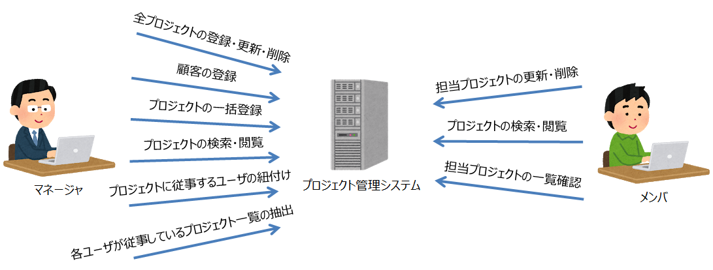
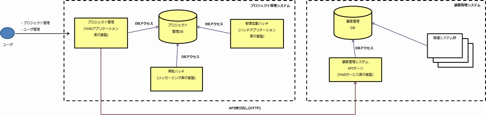
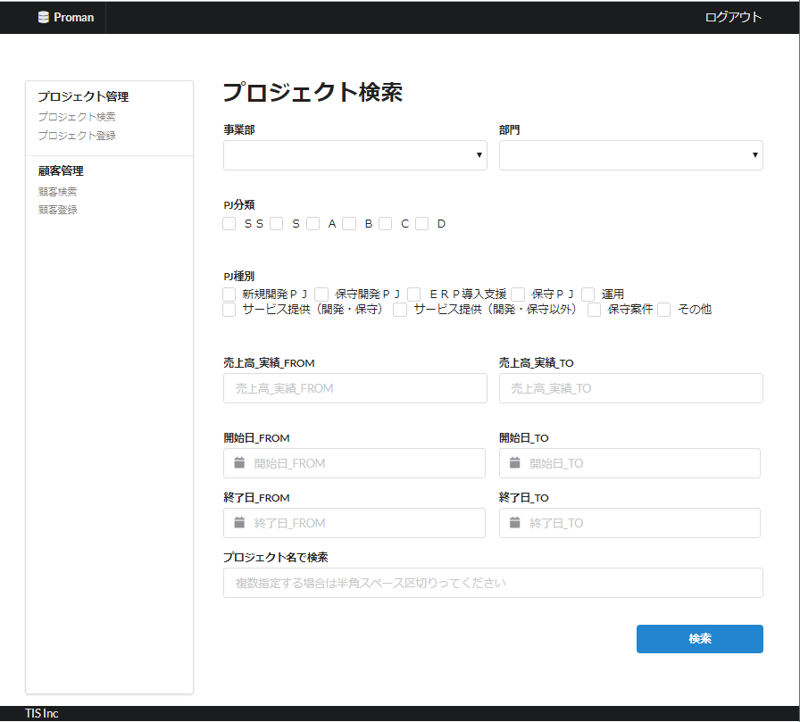

# サンプルアプリケーション

> ＜サンプルアプリケーションを参考にされる方へ＞  
> サンプルアプリケーションは、Nablarchシステム開発ガイドに従って開発した場合に作成される成果物をイメージしてもらうためのサンプルです。
> プロジェクトで開発を進めるにあたって重要となる開発ガイドやテスト標準を参考にできます。
> また、処理方式（Web、バッチ、REST）毎にサンプルで作成した開発ガイドを使用して実際にいくつか機能を開発しており、設計書とソースコードの対応なども確認できます。
>
> ただし、サンプルアプリケーションの要件や特性、状況に応じて成果物を作成しており、
> サンプルアプリケーションの成果物は、全ての開発プロジェクトで万能に機能するようなものではありません。
> また、ソースコードについては他のプロジェクトでそのまま流用できるものを意図して作成したものではありません。
> サンプルアプリケーションはNablarchシステム開発ガイドの利用イメージを伝えることに主眼を置いています。
>   
> Nablarchを使ったアプリケーション実装の最適な実装例を確認したい場合は、
> Nablarchの[Example](https://nablarch.github.io/docs/LATEST/doc/application_framework/example/index.html)
> または[解説書](https://nablarch.github.io/docs/LATEST/doc/application_framework/application_framework/index.html)を参照してください。

- [システムのプロファイル](#システムのプロファイル)
- [システム構成イメージ](#システム構成イメージ)
  - [利用者](#利用者)
- [画面イメージ](#画面イメージ)
  - [プロジェクト検索画面](#プロジェクト検索画面)
- [機能要件](#機能要件)
  - [画面](#画面)
  - [都度起動バッチ](#都度起動バッチ)
  - [常駐バッチ](#常駐バッチ)
  - [APIサーバ](#APIサーバ)
- [非機能要件](#非機能要件)
  - [認証要件](#認証要件)
  - [認可要件](#認可要件)
  - [ユーザインタフェース要件](#ユーザインタフェース要件)
  - [性能要件](#性能要件)
  - [可用性要件](#可用性要件)
  - [セキュリティ要件](#セキュリティ要件)
  - [対象外](#対象外)

## システムのプロファイル

- A社における「プロジェクト管理システム」を新規に構築する。
- 「プロジェクト管理システム」は、A社の各部署が実施する（予定を含む）プロジェクトについて、
その規模、顧客、期間、プロジェクト担当者を管理するシステムである。
- 「プロジェクト管理システム」はスモールスタートを行うため、ユーザの情報を独自管理するものとする。
- A社では既に「顧客管理システム」を持っており、「プロジェクト管理システム」からの参照・更新が発生する。当該システムのDBには直接アクセスできないセキュリティポリシーとなっているため、当該の一部機能を社内に公開するために API サーバを新規に構築する。

## システム構成イメージ
- 下図の黄色の部分が開発対象範囲である。

### 利用者
- A社社員のうち「プロジェクト管理システム」に明示的に登録されたユーザ

## 画面イメージ
### プロジェクト検索画面

## 機能要件

### 画面
- ログイン済ユーザであることを前提に、以下の操作が行えるプロジェクト管理機能を提供する。
    - プロジェクト情報を画面上で登録・更新・削除可能とする。
    - ユーザのロールには、マネージャとメンバの２種類がある。
    - 登録されたプロジェクト情報を複数条件の組み合わせで検索可能とする。マネージャ、メンバともに全プロジェクトの情報を閲覧可能。
        - 検索結果は多数に及び得るため、ページング表示を行う。
        - 検索結果一覧はCSVファイルとしてダウンロードを可能とする。
        - 顧客一覧は、「顧客管理システム」からAPI経由で取得する。
    - マネージャは、全プロジェクトの登録・更新・削除が可能とする。
    - マネージャは、新規の顧客情報を登録できる。
        - 顧客情報は「顧客管理システム」へのAPI要求で実現する。
    - マネージャは、アップロードしたCSVファイルからプロジェクトを一括登録できる。
        - 登録済のプロジェクトは更新を行う。
    - マネージャは、各プロジェクトに対し、従事するユーザを紐付けることができる。
    - メンバは、自身が担当するプロジェクトのみ更新・削除可能。
    - ユーザが可能な操作のみが、ユーザに動線として提供される。
        - 例えば、メンバには顧客登録用のメニューは出力しない。
    - 以下の機能の実行指示、状況確認、抽出結果のダウンロードができる。
        - 各ユーザが従事(紐付き)しているプロジェクト一覧の抽出。

### 都度起動バッチ
- プロジェクト一括登録バッチ (File to DB)
    - 営業システムから連携されたCSVファイルに一覧されるプロジェクトを登録する。
        - 既に登録済みのプロジェクトは更新する。
    - 業務日付を利用する。
- 期間内プロジェクト一覧出力バッチ (DB to File)
    - プロジェクト期間内のプロジェクトを一覧としてCSV出力する。
    - 業務日付を利用する。
- 常駐プロセス停止バッチ
- 業務日付更新バッチ

### 常駐バッチ
画面から登録された処理要求を待ち受け、要求が到着すると処理要求の種別に紐づく処理を実行する (ディレード処理)。

- ユーザ別従事プロジェクト抽出 (DB to File)

### APIサーバ
顧客管理システム。

- 顧客一覧取得 API
- 顧客詳細取得 API
- 顧客登録 API

## 非機能要件

### 認証要件

- 画面でのログイン認証については、Form 認証とする。パスワードは平文で保存せず、ソルト付きハッシュ + ストレッチングを行って保存する。
- 顧客管理システムにおけるAPI認証については、送信元IPアドレス制限にて対応するものとするため、アプリケーションでの考慮は不要とする。

### 認可要件

- ユーザが可能な操作のみが、ユーザに動線として提供される。
- 権限を持たないユーザが(ロケーションバーに直接URLを入力するなどして)画面遷移をする場合はエラーとする。

### ユーザインタフェース要件

- 画面については、社内PCからのみ利用を想定し、スマートフォン・タブレットは想定しない。
- ブラウザについては、Chrome のみとする。

### 性能要件

- 画面システムは応答時間３秒以内。
- それ以上に時間がかかると想定される機能は、ディレード処理とする。

### 可用性要件

- 画面、APIサーバについては、24H365D稼働。
- 常駐バッチについては、障害発生時に停止を許容する。ただし、その状況はアラートとして検知が必要。

### セキュリティ要件

- [IPAのセキュリティ実装 チェックリスト](https://www.ipa.go.jp/security/vuln/websecurity.html) 改訂新7版のすべての項目が「根本的解決」であること。

### 対象外
- ユーザ管理機能(ユーザアカウント登録/パスワード変更等) は提供しない。
    - ユーザアカウントの情報はテーブルにすでに登録されていることを要求事項とする。
- 画面はJSPで構築するものとし、Thymeleaf/FreeMaker は使用しない。
    - 最も使われている(=習熟したエンジニアが多い)のがJSPであるため。
- REST API については、排他制御を行わない (現状想定は、GET/POST のみ)。
- REST API については、認証・認可を行わない。
- 国際化対応はスコープ外とする。
- アップロードファイルを一時的に保存するディレクトリに対しウイルススキャンが行われ、ウイルスを検知した場合には保存時にエラーとなることを前提とする。
- 画面/バッチの開閉局制御は、マスタテーブルを直接更新してもらう前提。
- アプリケーションが保持する秘匿情報は、インフラでセキュリティが担保されていることを前提に、平文で設定ファイルに記載するものとする。
