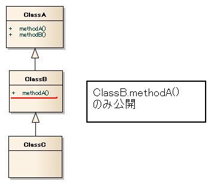

# 使用不許可APIチェックツール

使用不許可APIチェックツールの仕様と使用方法を解説します。

## 概要

本ツールは、Javaコーディング規約にて規定されている使用許可API以外のAPIを使用していないかチェックをするツールです。

使用できるAPIを限定することにより、安全でない実装を抑制できます。

## 仕様

使用許可APIの指定は、ホワイトリスト形式で設定ファイルに記述する仕様となっているため、Nablarch導入プロジェクトのコーディング規約に従いカスタマイズを行うことが可能です。
また、設定ファイルを自作することでNablarch以外のフレームワークを利用するプロジェクトにおいても使用不許可APIの検知を行うことが可能です。

使用許可APIは設定ファイルで指定します。
設定ファイルの記述方法は後述します。

使用許可API以外の呼び出しは、下記ルールに従いチェックを行います。

- 使用不許可クラスの参照（インスタンス化、クラスメソッドの呼び出し）
- 使用不許可メソッドの呼び出し
- 使用不許可例外の補足、及び送出

設定ファイルには次の単位で使用許可APIを指定できます。

- パッケージ
- クラスまたはインタフェース
- コンストラクタまたはメソッド

本ツールはSpotBugsのプラグインとして提供しています。
つまり、次のように通常のSpotBugs使用と同じ方法で使用できます。

- Eclipse Pluginとして実行
- Mavenを使用して実行

また、チェック結果も他のSpotBugsのバグレポートと同様に確認できます。

本ツールが提供する使用不許可APIチェックのSpotBugsにおけるバグコードとバグタイプは次の通りです。

- バグコード ： `UPU`
- バグタイプ ： `UPU_UNPUBLISHED_API_USAGE`

### 継承・インタフェース実装に関するチェック仕様

継承されたメソッド、インタフェースにて定義されたメソッドに対するチェック仕様は通常のチェック仕様とは異なります。
ここでは継承・インタフェース実装に関するチェック仕様について解説します。

以下に、`SubClass`が`SuperClass`を継承している場合のチェック仕様を示します。

```java
List<String> list = new ArrayList<>();
list.add(test); // Listインタフェースのaddメソッドが使用許可されていることをチェックする（ArrayListクラスではない）

SuperClass varSuper = new SubClass();
varSuper.testMethod(); // SuperClass.testMethodが使用許可されていることをチェックする

SubClass varSub = new SubClass();
varSub.testMethod(); // SubClass.testMethod()が使用許可されていることをチェックする
```

宣言されているクラス・インタフェースに当該のAPIが定義されていない場合、その親クラスまたはインタフェースを自クラスに近い方から順次検索します。
そして、最初にそのAPIが定義されているクラスが見つかったら、そのクラスのメソッドが使用許可されているか否かを判定します。

例として下図のような継承関係を考えます。



この時、使用可能か否かは次の通りです。

```java
ClassC hoge = new ClassC();
hoge.methodA(); // 使用可能
hoge.methodB(); // 使用不可
```

## 設定方法

ここでは、本ツールの設定ファイルの配置方法、記述方法を解説します。

### 設定ファイル配置方法

設定ファイルを格納したディレクトリ（以後、設定ファイルディレクトリ）には、複数の設定ファイルを配置できます。
設定ファイルの拡張子は「`config`」としてください。

例えば、Nablarchが提供するブランクプロジェクトには、Javaコーディング規約に準拠した設定ファイルとして以下のファイルが格納されています。

| 設定ファイル名                                  | 概要                                                                        |
|------------------------------------------|---------------------------------------------------------------------------|
| `JavaOpenApi.config`                     | Nablarchが規定するJava標準ライブラリ使用可能API                                           |
| `JakartaEEOpenApi.config`                | Nablarchが規定するJakarta EE標準ライブラリ使用可能API                                     |
| `NablarchApiForProgrammer.config`        | プログラマ向け Nablarch Application Framework 使用可能API （業務機能の実装に必要なAPI）           |
| `NablarchTestingApiForProgrammer.config` | プログラマ向け Nablarch Testing Framework 使用可能API （業務機能のテストに必要なAPI）              |
| `NablarchApiForArchitect.config`         | アーキテクト向け Nablarch Application Framework 使用可能API （NAFの機能拡張などで利用する必要があるAPI） |
| `NablarchTestingApiForArchitect.config`  | アーキテクト向け Nablarch Testing Framework 使用可能API （NTFの機能拡張などで利用する必要があるAPI）     |

設定ファイルは [published-config](https://github.com/nablarch/nablarch-single-module-archetype/tree/master/nablarch-web/tools/static-analysis/spotbugs/published-config) に格納されていますので、これらを参考に自プロジェクトで必要な設定ファイルをご用意ください。
また、上記はJakarta EEを前提とした設定ファイルとなりますが、Nablarchのプロダクトバージョン5(5、5u1、5u2...)ではJava EEを前提としているため、Java EEを使用する場合は[Nablarch5の最新ブランチ](https://github.com/nablarch/nablarch-single-module-archetype/tree/v5-master/nablarch-web/tools/static-analysis/spotbugs/published-config)の設定ファイルを参考にしてください。

前述の通り、Nablarchは対象とする開発者・スコープごとに4種類の設定ファイルを提供しています。
これらの設定ファイルの配置例を以下に示します。

```
<ワークスペース>
├─<プロジェクト>
│  │  ├─tool
│  │  │   ├─staticanalysis
│  │  │   │  ├─production（プロダクションコード用設定ファイルディレクトリ）
│  │  │   │  │  └─ NablarchApiForProgrammer.config
│  │  │   │  ├─test（テストコード用設定ファイルディレクトリ）
│  │  │   │  │  ├─ NablarchApiForProgrammer.config
│  │  │   │  │  └─ NablarchTestingApiForProgrammer.config
```

チェック対象がフレームワークの拡張などを行うためのコードの場合には、`NablarchApiForArchitect.config`, `NablarchTestingApiForArchitect.config`を利用してください。

**注意事項**

当ツールは、使用されている全てのAPIに対してチェックを実施します。
そのため、デフォルトで提供する設定ファイルのみでは、自プロジェクトで宣言しているAPIが使用不許可APIとして検知されます。

これを避けるには、自プロジェクトで宣言しているAPIを使用許可する設定を行う必要があります。
自プロジェクト用の設定ファイルを設定ファイルディレクトリに配置し、自プロジェクトのパッケージを一意に特定できるパッケージを記述してください。

例えば、プロジェクトにて作成する全てのパッケージが`com.example.project`で始まる場合、`com.example.project`と記述したテキストファイルを1つ設定ファイルディレクトリに配置してください。

### 設定ファイル記述方法

設定ファイルの1行につき、1つの使用許可APIを記述します。
記述の順序は問いません。

設定ファイルの記述例を示します。

```
java.lang
nablarch.fw.web
nablarch.common.code.CodeUtil
java.lang.Object
java.lang.Boolean(boolean)
java.lang.StringBuilder(java.lang.String)
nablarch.fw.web.HttpResponse.HttpResponse()
java.lang.String.indexOf(int)
nablarch.core.validation.ValidationContext.isValid()
nablarch.fw.web.HttpResponse.write(byte[])
nablarch.fw.web.HttpRequest.setParam(java.lang.String, java.lang.String...)
```

設定ファイルには、パッケージ、クラス、インタフェース、コンストラクタ、メソッドのレベルで使用許可したいAPIを指定できます。

#### 指定レベル：パッケージ

指定されたパッケージに含まれる全てのAPI（サブパッケージのAPIを含める。）を使用許可する場合の設定です。

```
// 例
// java.lang配下を使用許可する場合
java.lang
// nablarch.fw.web配下を使用許可する場合
nablarch.fw.web
```

#### 指定レベル：クラス、インタフェース

指定されたクラスまたはインタフェースに含まれる全てのAPIを使用許可する場合の設定です。

クラスの完全修飾名を記述してください。

```
// 例
// CodeUtilの全ての機能を使用許可する場合
nablarch.common.code.CodeUtil
// Result.Successの全ての機能を使用許可する場合
// Successは、Resultのネストクラス
nablarch.fw.Result.Success
```

#### 指定レベル：コンストラクタ、メソッド

指定されたコンストラクタまたはメソッドを使用許可する場合の設定です。

コンストラクタまたはメソッドの完全修飾名を記述してください。
参照型の引数も完全修飾名を記述してください。

```
// 例
// コンストラクタの場合
java.lang.Boolean.Boolean(boolean)
java.lang.StringBuilder.StringBuilder(java.lang.String)
nablarch.fw.web.HttpResponse.HttpResponse()

// メソッド呼出の場合
java.lang.String.indexOf(int)
nablarch.core.validation.ValidationContext.isValid()
nablarch.fw.web.HttpResponse.write(byte[])
nablarch.fw.web.HttpRequest.setParam(java.lang.String, java.lang.String...)

//*******************************************************************
// ネストクラスのコンストラクタの場合
//*******************************************************************
// ネストクラスの場合は、記述方法が完全修飾名とは異なるため注意すること。
// 以下にネストクラスの場合の記述例を示す。

// コンストラクタの場合
// SuccessがResultクラスのネストクラスの場合で引数なしコンストラクタを使用許可する場合は、
// コンストラクタ名は「Result.Success()」と設定すること。
// ※nablarch.fw.Result.Success.Success()と設定した場合、
// Result.Successクラスのコンストラクタは使用可能とはならないので注意すること。
nablarch.fw.Result.Success.Result.Success()
// 引数ありコンストラクタの場合
nablarch.fw.Result.Success.Result.Success(java.lang.String)

// メソッド呼出の場合
nablarch.fw.Result.Success.Result.getStatusCode()
```

## Eclipse Pluginとして使用

ここでは、Eclipse Pluginとして使用する場合の設定方法とチェック結果確認方法を解説します。

### SpotBugs Eclipse pluginをインストールする

eclipse marketplaceからSpotBugs Eclipse pluginをインストールしてください。

- [SpotBugs Eclipse plugin](http://marketplace.eclipse.org/content/spotbugs-eclipse-plugin)

### 使用不許可APIチェックプラグインを設定する

Eclipseの設定からSpotBugsの項目を開いてください。

「プラグインおよびその他の設定」タブを開いて「追加」ボタンを押してください。
`nablarch-unpublished-api-checker-<version>.jar`を選択してください。

`nablarch-unpublished-api-checker-<version>.jar`はMavenのローカルリポジトリに格納されているはずです。
Mavenのローカルリポジトリはホームディレクトリ以下の`.m2\repository`ディレクトリです。
※ローカルリポジトリに`nablarch-unpublished-api-checker-<version>.jar`が存在しない場合は、先に[Mavenを使用して実行](#Mavenを使用して実行)してください。


### 設定ファイルディレクトリを指定する

Eclipseホームディレクトリにある、`eclipse.ini`ファイルを修正します。

次の例のように、`-vmargs`の下に`-Dnablarch-findbugs-config=<テストコード用設定ファイルディレクトリの絶対パス>`を記述してください。

※<テストコード用設定ファイルディレクトリの絶対パス>に全角文字が含まれる場合バグチェックに失敗することがあります。パスに全角文字が含まれないようにしてください。

```
-vmargs
-Dnablarch-findbugs-config=C:/nablarch/workspace/example/spotbugs/published-config/production
```

ここまで設定を終えたら、Eclipseを再起動してください。

### バグチェックの実施と結果の確認

プロジェクトを右クリックしてSpotBugsメニューから「Find Bugs」を選択するとバグチェックが実施されます。

チェック結果は、エディターの左端に現れるバグマークまたは、SpotBugsパースペクティブにて確認できます。

なお、Eclipseでのチェックではアーキテクト向けとプログラマ向け、プロダクションコードとテストコードなどの分類に従ったチェックは行えないという制限があります。
ですので、CIなどで分類に従ったチェックを実施するようにしてください。

## Mavenを使用して実行

[MavenでのSpotBugsの実行方法](../spotbugs/docs/Maven-settings.md)を参照してください。
