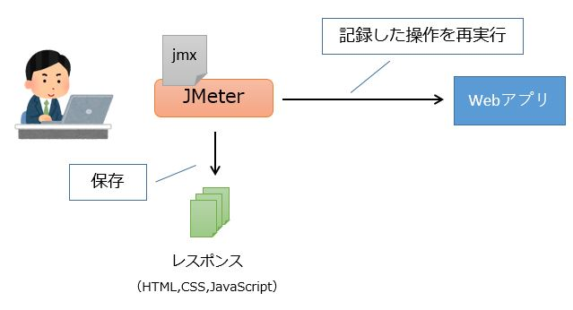

# 単体テストの考え方(Web)

これまでNablarchで提示されてきたテスト手法はテスティングフレームワークを活用して多くの部分を自動テストするものでした。
この手法は高いカバレッジを実現できる一方で、テストデータ作成、維持に大きな労力を必要としました。
上記の特性から大規模プロジェクトにおいては非常に有効でしたが、変更が多く発生するプロジェクトや、小～中規模のプロジェクトにおいては
担保するべき品質に対してコストが高く、採用が難しいという課題がありました。

本プロジェクトでは、コストと品質のバランスを重視したテスト手法を採用します。
最も労力が掛かっていたテストデータ作成、維持を最小限に留めます。
ただし、全て手動でテストするのではなく、テストコードを書いたほうが効率的な箇所は積極的にテストコードを書きます。

テストデータの作成、維持において特に労力が掛かっていたのがデータベースに関するものでした。
テーブル名やカラム名の変更は、多くのテストデータに影響するためです。
また、データベースアクセスを含むテストは、スローテストの要因にもなっていました。

これらの問題に対応するため、本プロジェクト(Webアプリケーション)では[リクエスト単体テスト](https://nablarch.github.io/docs/LATEST/doc/development_tools/testing_framework/index.html)を使用しません。
ただし、単純に今までやっていたことをやめるだけでは、品質の低下が懸念されるため、別のテストや机上確認で補います。
本プロジェクトでは製造・単体テスト工程までに以下の品質を確認します。

- 机上確認
- クラス単体テスト
- 取引単体テスト

## 成果物ごとの確認方法
開発者が作成する成果物とそのテスト方法を記載します。

| 成果物         | 机上 | クラス | 取引 |
| -------------- | ---- | ------ | ---- |
| Action         | -    | -      | o    |
| Form           | o    | o      | o    |
| ドメインクラス | o    | -      | o    |
| Service        | -    | o      | o    |
| SQLファイル    | o [^1] | -      | o    |
| Entity         | -    | -      | o    |
| DTO            | -    | -      | o    |
| JSP            | -    | -      | o    |
| routes.xml     | -    | -      | o    |

[^1]: SQLの確認は机上確認だけでなく、SQL Executorを使った動作確認も行う。

### Action

Actionクラスでは、取引単体テストにて手動で動作確認します。

従来、リクエスト単体テストでActionのテストを行っていましたが、
業務ロジック以外は取引単体テストで確認できるため、手動で確認するようにします。
- バリデーション制御(エラーが表示されることで確認可能)
- サービスの呼び出し(画面表示やDBなどの処理結果で確認可能)
- リクエストスコープ、セッションスコープへの値設定(画面表示で確認可能)
- フォワード(画面表示で確認可能)

業務ロジックは、後述するServiceクラスで実装するため、
Actionには業務ロジックは含まれません。

### Form

#### Formのアノテーション確認

Formのフィールドに、設計書に記載された通りのアノテーションが付与されていることを確認します。
（必須アノテーションおよびドメインアノテーション）
設計書とFormのソースコードを見比べて、目視で確認します。


アノテーションの付与は宣言的なものであり、テストコードを書く方法では効率良くバグを見つけることができません。
例えば、テストを書く場合、以下のような手順になります。

- Formの必須項目にnullを設定します
- バリデーションを実行します
- 必須エラーが発生することを確認します

しかし、このようなコードを書く時、設計書を見てその項目が必須であることを読み取って、上記のようなコードを書くはずです。
このような場合、設計書とFormのソースコードを見比べて、正しいアノテーションが付与されていることを確認するという方法でも
実質的にやっていることは同じであり、かつ、遥かに効率よく確認できます。

アノテーションを付与する場合、具体的なロジックや値（最大値、最小値等）は含まれていないため、
プログラミングの段階ではスペルミス以外のミスが混入することはありません。
（スペルミスはコンパイラやツールでチェックできるのでテストは不要）


#### バリデーションロジックの確認

必須アノテーションやドメインアノテーション以外で、`@AssertTrue`等を使ってバリデーションロジックを書いている場合、
クラス単体テストの対象とします。

### ドメインクラス

ドメイン定義を保持するクラスであり、ドメイン定義設計書を元に作成します。

ドメイン定義設計書からドメインクラスを作成する際に、間違った定義をしてしまう可能性はあります(例えば、最大桁の写し間違い)。
しかし、限界値分析によるテストコードを書いてその誤りを検知することは非効率であるため、
机上レビューにより確認します。


### Service

Serviceでは、いわゆる業務ロジックを記述します。
HttpRequestやExecutionContextなどNablarchのAPIは使わないようにします。

データベースアクセスにはユニバーサルDaoを使いますが、UniversalDaoクラスを使用するのではなく、
DaoContextインタフェースを使用（依存）するようにします。
staticメソッドを持つクラスUniversalDaoではなく、インタフェースDaoContextに依存するため、
データベースアクセスをスタブ化することが容易になります。


``` java
public class MyService {

    private final DaoContext universalDao;
     
    public MyService() {
        this(DaoFactory.create());
    }
    /** テスト用コンストラクタ */
    MyService(DaoContext universalDao) {
        this.universalDao = universalDao;
    }
}
```

``` java
DaoContext stub = new DaoStub() {
    @Override
    public T findByPk(int id) {
        return (T) new Foo("ふー");
    }
}
```

UniversalDaoの振る舞いをテストケース毎に変更する方法として、モックライブラリを使用するという手段も考えられましたが、
本プロジェクトでは以下の理由によりモックライブラリの採用を見送りました。

- 想定した動作をしない場合のトラブルシューティングが困難(特にアーキテクト離任後の保守フェーズ)
- バージョンアップにより後方互換性が崩れる場合がある(e.g. JMockit)


### SQLファイル

設計工程でSQLを検討する必要がありますが、机上でSQLを設計してしまうと品質が十分確保できないという問題があります。
このため、設計時点でSQLを試行しながら設計することとし、SQLファイルも同時に作成します。
（このSQLファイルはPGUT工程へのインプットとなります）

SQLを試行できるよう、SQL Executorを使用します。


### Entity

GSPプラグインで自動生成するため、クラス単体テスト対象外とします。

### DTO

ロジックを含まず、かつアクセサはIDEで自動生成するため、クラス単体テスト対象外とします。

### JSP

従来どおり、取引単体テストで確認します。


### routes.xml

ルーティングのミスは、手動でテストしたときに容易に発見できるので、取引単体テストで確認します。


## 取引単体テストの回帰テスト
取引単体テストは、回帰テストの負担を軽減するため初回のみ打鍵で行い、２回目以降は自動テストツールを使って自動化します。

以下で、手順の概要を説明します。  
各手順の詳細な説明は、[取引単体テストのテスト方法（Web）](取引単体テストのテスト方法（Web）.md)を参照してください。

### 1. 初回の打鍵テスト
#### 1-1. ブラウザ操作とエビデンスを記録する


まず、初回は打鍵でテストを行います。

このとき、Apache JMeterのHTTP(S) Test Script Recorderという機能を利用してブラウザで行った操作を記録しておきます。  
操作記録はJMeterのテスト計画ファイルであるjmxファイルとして保存されます。

また、このとき画面のハードコピーやデータベースのダンプなどのエビデンスも手動で記録しておきます。

#### 1-2. レスポンスを記録する


記録したjmxファイルを実行し、レスポンスファイル（HTML,CSS,JavaScript）を記録します。

### 2. 二回目以降の自動テスト


２回目以降の回帰テストでは、取引単体テストを自動実行するツールを使用します。

初回の打鍵テストで記録したjmxファイルやエビデンス、レスポンスファイルを自動テストツールの所定のディレクトリに配置することで、取引単体テストを自動実行できます。

これにより、回帰テストのコストを抑えることができます。
