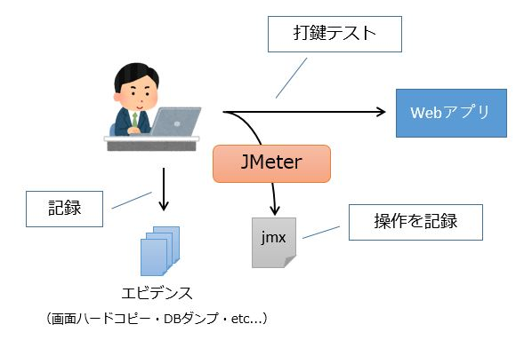
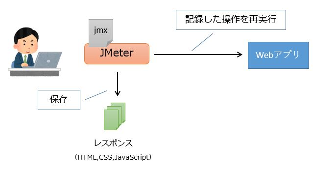
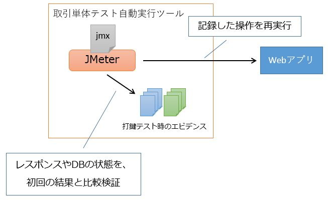

# 取引単体テストのテスト方法（Web）

## 初回の打鍵テスト
初回の打鍵で取引単体テストを行う手順について説明します。  
取引単体テストの概要を確認したい場合は、[取引単体テストの回帰テスト](単体テストの考え方（Web）.md#取引単体テストの回帰テスト)を参照してください。  
以下で使用するツールの初期セットアップ手順については、[開発環境構築ガイド](../開発環境構築ガイド.md)を参照してください。

### ブラウザ操作とエビデンスを記録する

#### テストデータを準備する
打鍵テストで使用するテストデータを準備します。

単体テスト用データダンプツールには、ダンプしたデータをDBにインサートしなおす機能があります。  
したがって、テストで使用するデータをあらかじめダンプツールで抽出しておけば、ダンプツールのインサート機能を使って何度でも同じデータで取引単体テストを行えるようになります。

以下で、インサート用のテストデータを作成する手順を説明します。

まず、DBをテスト直前の状態にします。
そして、ダンプツールを使用してテスト前のDBのダンプを取得します。  
ダンプの取得方法については[エビデンスの取得方法（ログとDBダンプ）](エビデンスの取得方法（ログとDBダンプ）.md)を参照してください。

ダンプファイルが作成できたら、以下の手順でテストデータ登録用のファイルを作成します。

1. ダンプツールのExcelファイル（DUMP.xlsm）を開き、テーブル定義一覧を更新してください。（手順は[エビデンスの取得方法（ログとDBダンプ）](エビデンスの取得方法（ログとDBダンプ）.md)を参照してください）
1. MAINシートを開きデータを挿入するテーブルについて挿入列を「○」に変更してください。
1. テスト直前の状態を抽出したダンプファイルを開き、挿入対象のテーブルをDUMP.xlsmのINSERTシートにコピーします。（INSERTシートに記載する内容については、使い方.xlsxを参照してください）

以上で、テストデータの登録準備は完了です。

#### テストデータを登録する
1. INSERTシートにテストデータを記載したDUMP.xlsmを開き、MAINシート画面上部の「起動」をクリックします。
1. ダンプツールのウインドウが表示されます。表示されたウインドウの「インサート」をクリックします。

#### JMeterでリクエストを記録する
JMeterのHTTP(S) Test Script Recorderという機能を使って、打鍵テスト時のリクエストを記録します。  

1. テストシナリオごとに[テスト計画-テンプレート.jmx](取引単体テストツール/テスト計画-テンプレート.jmx)をコピーし、任意の名前にリネームしてください。
1. 各自の環境用に設定した[JMeter起動用バッチ.bat](取引単体テストツール/JMeter起動用バッチ.bat)でJMeterを起動します。
1. 1で作成したjmxファイルをJMeterで開きます。
1. 画面左側「ユーザー定義変数」を選択し、`server.host`の値として設定されている`localhost`を自端末のIPアドレスに変更します。
    - `server.host`に自端末のIPアドレスを設定しておくことで、以下で記録したリクエストのサーバ名が`${server.host}`というプレースホルダーになります。こうしておくことで取引単体テストの自動実行時、`server.host`は設定ファイルに記載したテスト環境のアドレスに置き換えられるようになります。
1. 画面左側「HTTPプロキシサーバ」を選択し、「開始」ボタンを押下します。
1. プロキシ用のダミー証明書をインストールします。
    - JMeterを解凍したディレクトリのbin配下に `ApacheJMeterTemporaryRootCA.crt` が生成されるためダブルクリックします。
    - 「証明書のインストール」->「現在のユーザー」->「証明書を全て次のストアに配置する」から「信頼されたルート証明機関」を選択し、インストールします。
    - 証明書の期限は7日間に設定されているため、期限が切れるたびにインストールしてください。
1. JMeterをHTTPプロキシサーバとして設定したChromeのショートカットにてブラウザを開き、自端末のIPアドレスでアクセスし取引単体テストを行います。（ログインから行うこと）
    - ログイン画面表示後「テスト計画」→「スレッドグループ」→「記録コントローラ」に行が増えてリクエストが記録できていることを確認してください。
        - [開発環境構築ガイド](../開発環境構築ガイド.md#jmeterのプロキシを利用するためのchromeショートカット)に記載の通り、JMeterをHTTPプロキシサーバとして設定したChromeのショートカットはCSSやJavaScriptについて、キャッシュを利用しないようシークレットモードにて起動します。起動後は最初のリクエストで取得したキャッシュが利用されます。そのため複数シナリオを同じウィンドウで続けて記録してしまうと2つ目以降のシナリオにCSSやJavaScriptの取得リクエストが含まれない場合があります。必ずシナリオごとにChromeのショートカットから新しいウィンドウを起動するようにしてください。
        - `localhost` でアクセスするとプロキシを設定してもブラウザがバイパスするため、自端末のIPアドレスでアクセスしてください。
        - 「記録コントローラ」にリクエストの行が増えていない場合はプロキシ設定が間違っている可能性が高いので確認してください。
        - 上記で解決しない場合は、JMeterの起動で使用した「JMeter起動用バッチ.bat」と同じ位置に出力されるjmeter.logを確認してください。
1. 1つのテストシナリオで必要な操作完了後、JMeterのHTTPプロキシサーバを停止します。
1. 画面左側「ユーザー定義変数」を選択し、`server.host`の値を`localhost`に変更します。
1. テスト計画を保存してください。

#### 画面のハードコピーを取得する

1. ウィンドウサイズ指定ツール(Sizer)を起動します。
1. ブラウザを起動します。
1. ブラウザの右下の角にマウスカーソルを当てて右クリックします。
1. 表示されたメニューをクリックし、テストに使用するブラウザのサイズに変更します。
1. 画面のハードコピーはChromeの開発者ツールで取得します。
    - 開発者ツールを開いた状態で`Ctrl+Shif+P`と押下すると入力ウィンドウが表示されます。
    - 入力ウィンドウに`full`と入力すると"Capture full size screenshot"と機能が表示されるのでEnter`キーを押下します。ダウンロードウィンドウが表示されるので任意の場所に保存してください。

#### ダンプツールでDBのダンプを取得する

単体テスト用データダンプツールを使って、打鍵テスト直後のDBからダンプを取得します。  
具体的な手順は、[エビデンスの取得方法（ログとDBダンプ）](エビデンスの取得方法（ログとDBダンプ）.md)を参照してください。

### レスポンスを記録する

レスポンスのファイルは、[JMeterでリクエストを記録する](#JMeterでリクエストを記録する)で記録したテスト計画（jmxファイル）を再実行することで取得します。  
再実行中は基本的に一時停止できません。テスト中はDBの状態を変更しないでください。

1. [JMeterでリクエストを記録する](#JMeterでリクエストを記録する)で作成したテスト計画（jmxファイル）をJMeterで開きます。
1. DBをテスト実行前の状態にします。手順は[テストデータを登録する](#テストデータを登録する)を参照してください。
1. 画面上部の実行ボタンを押します。
   - テスト計画（jmxファイル）と同じ位置にHTMLやCSS,JavaScriptファイルが出力されていることを確認してください。
     - 作成されていない場合、JMeterの起動で使用した「JMeter起動用バッチ.bat」と同じ位置に出力されるjmeter.logを確認してください。
     - すでにファイルが保存されている場合はエラーとなります。移動または削除してから再度実行してください。
1. DBの状態・出力されたレスポンスを確認し想定通りの結果か確認してください。

#### レスポンスファイル
テスト計画（jmxファイル）と同じ位置にHTML,CSS,JavaScriptファイルが出力されます。

ここで取得できるHTMLファイルは、自動テストのアサーションでレスポンスが変化していないことを確認するために使用します。
直接ブラウザで開いてもCSSが適用されないため、見た目の確認はできません。  
見た目の確認はJMeterでテストを記録するときに目視で行い、画面のハードコピーを保存するようにしてください。

見た目が確認できないのにCSSやJavaScriptを保存している理由は、「目視で確認したときのCSS,JavaScriptを保存しておき、それと同じファイルが回帰テストでも返却されていれば、ブラウザ上での結果は同じと言える」という考えに基づいています。

なお、出力されたHTMLファイルは二重サブミットトークンの値が本来のものとは異なります。
これは二重サブミットトークンの値は使用されるたびに変更される値であり、回帰テストを行った際この値に不要な差分が発生することを防ぐためです。

## エビデンスとレスポンスを保存する
初回の打鍵テストで取得した各種エビデンスとレスポンスファイル、およびテスト計画（jmxファイル）は、`/サンプルプロジェクト/設計書/A1_プロジェクト管理システム/020_方式設計/020_開発標準/020_テスト標準/単体テスト標準.xlsx` の `3.3.4. エビデンスの格納方法` に従って保存してください。

また、取引単体テストの自動実行ツールを使って回帰テストを行う場合は、自動実行ツール用に一部のファイルを加工する必要があります。  
詳しくは、自動実行ツールの[README](../../../ソースコード/proman-project/proman-jmeter/README.md)の「テストシナリオの作り方」を参照してください。

## 二回目以降の自動テスト

初回の打鍵テストで記録したエビデンスやテスト計画を使い、取引単体テストを自動実行する仕組みが用意されています。  
詳しくは [取引単体テストの自動実行方法（Web）](取引単体テストの自動実行方法（Web）.md) を参照してください。

## その他：打鍵テストのTips
取引単体テストの「こういうときどうするか」について、個別のケースごとに説明します。

### 「排他制御エラー」のテスト

1. IDEでアプリを起動します。
1. Chromeを起動します(以降ブラウザAと呼びます)。
1. ブラウザAのメニューから「シークレット ウインドウを開く」を選択し、もう1つChromeを起動します (以降ブラウザBと呼びます)。
   ２つのブラウザを開くのはセッションがブラウザ間で共有されてしまうことを防ぐためです。
1. ブラウザA、ブラウザBともに、同じデータを表示した更新画面に遷移します。
1. ブラウザBで確定します。
1. ブラウザAで確定を押したときに排他制御エラーが発生したことを表す画面に遷移することを確認します。

### 「二重サブミットエラー」のテスト

1. IDEでアプリを起動します。
1. ブラウザを起動して、テスト対象の画面まで遷移します。
1. ブラウザでテスト対象のボタンをクリックします。
1. ブラウザの戻る機能で戻ります。
1. テスト対象のボタンをクリックします。  
   ここで、2と同じトークンが送信されるため、二重サブミットエラーを確認できます。

### 「メッセージ表示（項目別）」のテスト

「単体テスト仕様書」→「取引単体①」→「メッセージ表示（項目別）」のテストは、
エラーメッセージが適切な位置に表示されているかを確認します。  
以下の理由により、エラーのバリエーションのテストは行いません。

- 「適切なドメインが付与されていれば、適切なエラーメッセージが出る」ので、エラーのバリエーションのテストは不要となります。適切なドメインが付与されているか否かは、Formクラスのレビューで担保します。
- 各項目、エラーメッセージを一種類ずつ確認することで、バリデーションが機能しているかの確認が可能です。

相関チェックについてはクラス単体テストでテストします。
