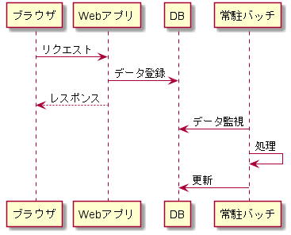

# Nablarchでの非同期処理

NablarchのWebアプリケーションでは、非同期処理は「常駐バッチ」を組み合わることで実現可能です。

例えば、Webアプリケーションで1つのリクエストで処理するには時間がかかり過ぎるものがあるとします。
この場合、以下のように常駐バッチを使用することで非同期処理を実現できます。

- Webアプリはリクエストを受け付けて後続処理に必要なデータをDBに登録し、レスポンスを返却する
- 常駐バッチがDBへのデータ登録を検知し、当該データの処理を行う

